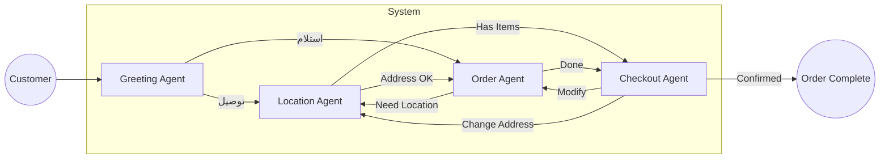

# Design Document: Arabic Restaurant Ordering Agent

## 1. Architecture Overview

### 1.1 Agent Flow Diagram



### 1.2 Handoff Triggers

| Transition | Trigger |
|---|---|
| Greeting → Location | User intents "توصيل" (delivery) |
| Greeting → Order | User intents "استلام" (pickup) |
| Location → Order | Location confirmed/changed to pickup + no order items yet |
| Location → Checkout | Location confirmed/changed to pickup + has order items |
| Order → Checkout | User intents that they are done "خلاص" / "بس" / "تمام" |
| Checkout → Order | User wants to add/remove/modify items |
| Checkout → Location | User wants delivery but address not set |

### 1.3 Does Agent B See Agent A's System Prompt?

**No.** The OpenAI Agents SDK enforces this:
1. Each agent has its own `instructions` (system prompt).
2. On handoff, the Runner switches to the new agent's instructions.
3. System prompts are **never** passed between agents.

---

## 2. Context Management Strategy

### 2.1 Two-Level Context Injection

There are **two separate mechanisms** for context handling. Understanding *when* each runs is critical:

| Scenario | Level 1 (main.py) | Level 2 (filters) |
|---|---|---|
| **Normal turn** (same agent) | ✅ Runs | ❌ Does not run |
| **Handoff turn** (switching agents) | ✅ Runs first | ✅ Then runs |

**Flow Diagram:**

```
User Message
    │
    ▼
┌─────────────────────────────────────────────────────┐
│  LEVEL 1: main.py (EVERY turn)                      │
│  ─────────────────────────────────────────────────  │
│  1. Get/create session                              │
│  2. Build <SESSION_STATE> from session data         │
│  3. Inject last 10 messages as "المحادثة السابقة"   │
│  4. Append current user message                     │
│  5. Call agent with enriched input                  │
└─────────────────────────────────────────────────────┘
    │
    ▼
┌─────────────────────────────────────────────────────┐
│  Agent processes message...                         │
│  • Uses tools, generates response                   │
│  • May decide to HANDOFF to another agent           │
└─────────────────────────────────────────────────────┘
    │
    ├── No handoff → Agent responds, turn ends
    │
    └── Handoff requested 
            │
            ▼
        ┌─────────────────────────────────────────────────────┐
        │  LEVEL 2: filters.py (ONLY on handoffs)             │
        │  ─────────────────────────────────────────────────  │
        │  1. Filter intercepts SDK's input_history           │
        │  2. Builds fresh SESSION_STATE from SessionStore    │
        │  3. Adds task description for new agent             │
        │  4. Replaces SDK history with compact summary       │
        │  5. New agent starts with clean context             │
        └─────────────────────────────────────────────────────┘
```

**Key Insight**: Level 1 builds context into the *message content itself*. Level 2 controls what the *SDK framework* passes during handoffs. They don't conflict—Level 2 just ensures clean handoffs without duplicating the SESSION_STATE that Level 1 already provides.

---

#### Level 1: Main Router (`main.py`)

Before each agent call, the router builds the input message with three parts:

```
<SESSION_STATE>
  اسم العميل: محمد ✓
  نوع الطلب: توصيل
  الحي: النرجس ✓
  الطلب الحالي:
    • 2 برجر لحم - 94 ريال
</SESSION_STATE>

## المحادثة السابقة:
العميل: أبي برجر
المطعم: عندنا برجر لحم وبرجر دجاج...
العميل: لحم
المطعم: تم إضافة برجر لحم ✓

رسالة العميل الحالية: {new message}
```

**History Storage:**
- Session stores up to **20 messages** total
- Each turn, the last **10 messages** (5 exchanges) are injected into the message content

---

#### Level 2: Handoff Filters (`core/filters.py`)

When switching agents, the SDK normally passes the full conversation history. Our **handoff filters** intercept this and replace it with a compact summary.

**What the filters do:**

1. **Build SESSION_STATE** - Calls `_build_session_context()` which reads from `SessionStore.get_current()` and creates a structured block with all confirmed data (name, phone, order items, location, constraints, pending items).

2. **Extract last user message** - Preserves what the user just said for continuity.

3. **Add task description** - Tells the new agent what to do (e.g., "العميل يريد تعديل طلبه").

4. **Replace SDK history** - Returns `HandoffInputData` with:
   ```python
   return HandoffInputData(
       input_history=summary,      # Our SESSION_STATE + task
       pre_handoff_items=(),       # Empty - drop SDK's items
       new_items=(),               # Empty
   )
   ```

**Why replace instead of pass through?**
- The SESSION_STATE already contains all *confirmed* data
- Full conversation history would bloat context and slow TTFT
- Agents don't need to see "how" data was collected, just "what" was collected

**Available Filters:**
| Filter | When Used |
|---|---|
| `filter_greeting_to_location` | Greeting → Location |
| `filter_greeting_to_order` | Greeting → Order |
| `filter_location_to_order` | Location → Order |
| `filter_location_to_checkout` | Location → Checkout |
| `filter_order_to_checkout` | Order → Checkout |
| `filter_order_to_location` | Order → Location (mode switch) |
| `filter_checkout_to_order` | Checkout → Order (modifications) |
| `filter_checkout_to_location` | Checkout → Location (address change) |

---

### 2.2 Truncation (`truncation_filter.py`)

This filter runs **before every LLM call** via the SDK's `call_model_input_filter` hook.

**Token Thresholds per Agent:**

| Agent | Model | Threshold |
|---|---|---|
| Greeting | `gpt-4o-mini` | 4,000 |
| Location | `gpt-4o-mini` | 6,000 |
| Order | `gpt-4o` | 12,000 |
| Checkout | `gpt-4o` | 8,000 |

**How Truncation Works:**

1. **Count tokens** - Uses `tiktoken` to count tokens in:
   - Agent instructions (system prompt)
   - All input messages

2. **Check threshold** - If `total_tokens <= threshold`, pass through unchanged.

3. **Truncate if over** - If over threshold:
   - Keep **first message** (usually contains SESSION_STATE context)
   - Keep **last 6 messages** (3 turns for recency)
   - **Drop middle messages**

4. **Return modified input** - Returns new `ModelInputData` with truncated messages.

---

## 3. Tool Definitions

### Greeting Agent
| Tool | Purpose |
|---|---|
| `set_order_mode` | Set delivery/pickup intent |
| `set_customer_name` | Capture customer name |
| `set_phone_number` | Capture phone if provided early |
| `add_pending_item` | Store order items mentioned for later |

### Location Agent
| Tool | Purpose |
|---|---|
| `check_delivery_district` | Validate coverage, set fee/time |
| `set_delivery_address` | Store street + building |
| `set_order_mode` | Switch pickup ↔ delivery |
| `get_order_summary` | Help decide routing |

### Order Agent
| Tool | Purpose |
|---|---|
| `search_menu` | Semantic search (FAISS + embeddings) |
| `add_to_order` | Add item to cart |
| `modify_order_item` | Change quantity/size by name |
| `remove_from_order` | Remove item by name |
| `store_offered_items` | Save options shown to user |
| `select_from_offered` | Add user's selection from options |
| `get_pending_items` | Retrieve items from greeting |
| `clear_pending_orders` | Mark pending items as processed |

### Checkout Agent
| Tool | Purpose |
|---|---|
| `calculate_total` | Compute subtotal + delivery fee |
| `set_customer_info` | Store/update name, phone, address |
| `confirm_order` | Finalize (requires name + phone) |
| `set_order_mode` | Switch pickup ↔ delivery |
| `get_session_state` | Read current state |

---

## 4. LLM Selection

### Why GPT-4o / GPT-4o-mini?

| Criterion | GPT-4o | Notes |
|---|---|---|
| **Arabic Language** | ✅ Excellent | Best-in-class for Gulf dialect, MSA, and mixed عامية |
| **Function Calling** | ✅ Reliable | Consistent tool call formatting, rarely hallucinates parameters |
| **Cost** | ✅ Affordable | ~$0.005/order via OpenRouter (vs $0.03+ for Claude) |
| **Latency** | ✅ Fast | 1-2s TTFT typical via OpenRouter |

### Per-Agent Model Choice

| Agent | Model | Justification |
|---|---|---|
| **Greeting** | `gpt-4o-mini` | Fast TTFT for first impression. Simple intent classification. |
| **Location** | `gpt-4o-mini` | Address parsing is straightforward. 1 tool call max. |
| **Order** | `gpt-4o` | Needs semantic understanding of Arabic food terms + multi-item tool sequences. |
| **Checkout** | `gpt-4o` | High precision for confirmation. Must enforce info collection before `confirm_order`. |

### Arabic Handling

GPT-4o handles Gulf dialect well:
- **Code-switching**: "أبي large meal" → understands mixed Arabic/English
- **Dialectal variations**: "برقر" → maps to "برجر"
- **MSA + عامية mixing**: System prompts in English/MSA, user speaks عامية

---

## 5. Logging

Logging is implemented via `LoggingHooks` in `main.py` and structured logger in `core/logging.py`.

**What Gets Logged:**

| Event | Format | Example |
|---|---|---|
| Agent Start | `[AGENT START] {name}` | `[AGENT START] order_agent` |
| Tool Call | `[TOOL START] {name}` | `[TOOL START] search_menu` |
| Tool Result | `[TOOL END] {name}` | `[TOOL END] search_menu` |
| Handoff | `[HANDOFF] {from} → {to}` | `[HANDOFF] greeting_agent → location_agent` |
| Turn Complete | `[TURN COMPLETE] Duration: {ms}ms` | `[TURN COMPLETE] Duration: 1234ms` |

**Structured Logs** (optional JSON mode):
```json
{
  "event": "handoff",
  "from_agent": "greeting_agent",
  "to_agent": "location_agent",
  "session_context": {"customer_name": "أحمد", "order_mode": "delivery"}
}
```

**Truncation Logging:**
When context exceeds threshold, logged as:
```
[INFO] TRUNCATION: order_agent has 15000 tokens (threshold: 12000)
[INFO] TRUNCATION: order_agent reduced from 15000 to 9500 tokens (dropped 5 messages)
```

---

## 6. Edge Cases

### 5.1 User Changes Mind (Mid-Flow)
**Scenario**: User in Checkout says "خليه استلام".
- `set_order_mode("pickup")` → Router re-evaluates → Routes to Order.
- Order preserved, mode changed.

### 5.2 Item Not on Menu
**Scenario**: User asks for "سوشي".
- `search_menu("سوشي")` → `found: false`.
- Response: "عذراً، ما عندنا سوشي. عندنا [categories]."

### 5.3 Ambiguous Item
**Scenario**: User asks for "برجر".
- `search_menu("برجر")` → `confidence: medium` + options.
- Response: "عندنا برجر لحم وبرجر دجاج. أي واحد تبي؟"
- User says "لحم" → `select_from_offered("لحم")`.

### 5.4 Uncovered Location
**Scenario**: User wants delivery to "الدمام".
- `check_delivery_district("الدمام")` → `covered: false`.
- Response: "عذراً، الدمام خارج نطاق التوصيل. تبي استلام؟"

### 5.5 Modify Existing Order Item
**Scenario**: User says "خلي الكرك ٤ بدال ٥".
- `modify_order_item(item_name="كرك", quantity=4)`.
- Quantity updated, total recalculated.

---

## 7. Testing Framework

### 7.1 Overview

The test framework (`tests/`) uses **LLM-driven customer simulation** instead of static scripts. This makes tests more realistic and robust.

### 7.2 Components

| Component | File | Purpose |
|---|---|---|
| **Customer LLM** | `evaluator/customer_llm.py` | Simulates human customer using an LLM |
| **Terminal Runner** | `evaluator/terminal_runner.py` | Runs `main.py` via pexpect, exact same code path |
| **LLM Judge** | `evaluator/judge.py` | Scores conversations on criteria |
| **Run Eval** | `run_eval.py` | Orchestrates scenarios, generates reports |

### 7.3 Customer Personas

Each scenario defines a `CustomerPersona` with:
- **Goal**: What the customer wants to achieve
- **Personality**: How they communicate (dialect, style)
- **Constraints**: Things they must do (e.g., "Order burger", "Give address")
- **Success Criteria**: How to know the goal is achieved

**Example Scenarios:**
- `simple_pickup` - Basic pickup order
- `simple_delivery` - Basic delivery order
- `pickup_to_delivery` - Mode switch mid-order
- `arabic_dialect` - Heavy Gulf dialect
- `code_switching` - Mix Arabic and English
- `error_recovery` - Request unavailable items, typos
- `ambiguous_items` - Vague requests needing clarification

### 7.4 Running Tests

```bash
# Run all scenarios
python tests/run_eval.py --all

# Run specific scenario
python tests/run_eval.py --scenario simple_pickup

# Verbose output
python tests/run_eval.py --all --verbose
```

**Output**: Reports saved to `tests/logs/` (Markdown + JSON).
