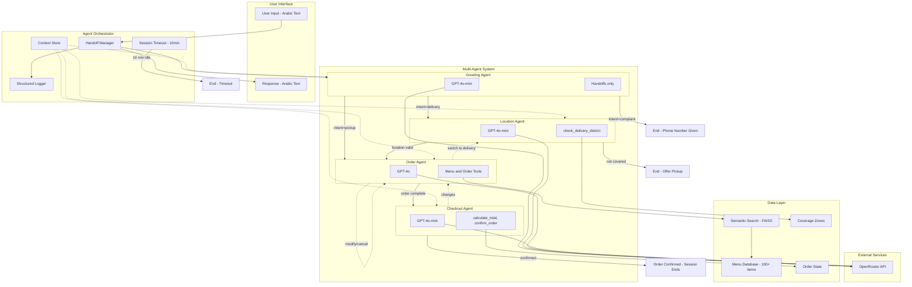

# Arabic Restaurant Ordering Agent - Design Document

> This is the original design document that was made, through discussions with Claude Opus 4.5, before starting implementing this task. It not the final state of the implmentaion, as number of things have changed while implementing this task for an up-to-date version that is human readble see the `Design.md` file. 

> **Assessment Submission**  
> **Date:** December 2025  
> **Language:** Arabic (All agent conversations)  

---

## Table of Contents

1. [Executive Summary](#1-executive-summary)
2. [Architecture Overview](#2-architecture-overview)
3. [Context Management Strategy](#3-context-management-strategy)
4. [LLM Selection](#4-llm-selection)
5. [Tool Definitions](#5-tool-definitions)
6. [Arabic System Prompts](#6-arabic-system-prompts)
7. [Edge Cases & Error Handling](#7-edge-cases--error-handling)
8. [Session Management](#8-session-management)
9. [Implementation Details](#9-implementation-details)
10. [Logging Architecture](#10-logging-architecture)
11. [Production Considerations (Bonus)](#11-production-considerations-bonus)
12. [Trade-offs & Alternatives](#12-trade-offs--alternatives)

---

## 1. Executive Summary

This document outlines the design for an Arabic-language restaurant ordering agent using a multi-agent architecture. The system handles delivery orders through four specialized agents: **Greeting**, **Location**, **Order**, and **Checkout**.

**Target Platform:** Text-based chat (WhatsApp ordering system, call center backend)

### Scope Clarification

| Feature | Status | Notes |
|---------|--------|-------|
| **Delivery ordering** | Primary | Full implementation - the main assessment requirement |
| Pickup ordering | Optional extension | Simplified flow (skips Location agent) |
| Inquiry handling | Optional extension | Agent answers then offers to take order |
| Complaint handling | Optional extension | Provides phone number, no separate agent |

The primary happy path focuses on **delivery ordering** as specified in the assessment:
> "A customer messages the restaurant. Your system must: 1) Greet... 2) Collect delivery location... 3) Take order... 4) Confirm with total (including delivery fee)"

### Key Design Decisions

| Decision Area | Choice | Rationale |
|--------------|--------|-----------|
| **Primary LLM** | GPT-4o-mini via OpenRouter | Best Arabic + function calling + cost balance |
| **Order Agent LLM** | GPT-4o via OpenRouter | Complex menu reasoning requires stronger model |
| **Checkout Agent LLM** | GPT-4o via OpenRouter | Must enforce customer info collection before confirmation |
| **Framework** | OpenAI Agents SDK | Simple handoffs, production-ready, clean API |
| **API Gateway** | OpenRouter | Single API for multiple models, cost-effective |
| **Menu Strategy** | Multi-Stage Search (Exact → Keyword → Semantic) | Better accuracy, handles ingredient queries |
| **Address Collection** | Structured (district + street + building) | Complete delivery addresses, fewer failed deliveries |
| **Dialect Support** | Gulf + MSA + Code-switching | Natural user interaction |

### Estimated Cost Per Order (via OpenRouter)

| Component | Input Tokens | Output Tokens | Model | Cost (USD) |
|-----------|-------------|---------------|-------|------------|
| Greeting Agent (3 turns) | 800 | 200 | GPT-4o-mini | $0.00024 |
| Location Agent (5 turns) | 1,500 | 400 | GPT-4o-mini | $0.00045 |
| Order Agent (10 turns) | 4,000 | 1,500 | **GPT-4o** | $0.025 |
| Checkout Agent (5 turns) | 2,000 | 500 | **GPT-4o** | $0.010 |
| Embeddings (6 queries) | 1,200 | - | text-embedding-3-small | $0.000024 |
| **Total** | **~9,500** | **~2,600** | - | **~$0.036/order** |

*Note: Checkout uses GPT-4o to ensure customer info is collected before confirmation.*

#### Buffer for Edge Cases

Add 30% buffer for:
- User changing mind (mode switches)
- Complex orders with modifications
- Multiple search queries

**Realistic budget**: **$0.035 per order**

---

## 2. Architecture Overview

### 2.1 High-Level Agent Flow

```
┌─────────────────────────────────────────────────────────────────────────────┐
│                          USER INPUT (Arabic Text)                            │
└─────────────────────────────────────────────────────────────────────────────┘
                                      │
                                      ▼
┌─────────────────────────────────────────────────────────────────────────────┐
│                           GREETING AGENT                                     │
│  ─────────────────────────────────────────────────────────────────────────  │
│  Model: GPT-4o-mini (via OpenRouter)                                        │
│  Purpose: Welcome user, determine intent (order/pickup vs complaint)        │
│  Tools: None (uses handoff tools directly)                                  │
│  Arabic Prompt: Gulf dialect, friendly tone                                 │
│  ─────────────────────────────────────────────────────────────────────────  │
│  Entry: Session start                                                       │
│  Exit: Intent confirmed → Handoff based on intent                           │
│        Complaint → Apologize + give phone number (no handoff)               │
└─────────────────────────────────────────────────────────────────────────────┘
                                      │
                    ┌─────────────────┼─────────────────┬────────────────┐
                    ▼                 ▼                 ▼                ▼
        ┌───────────────────┐ ┌───────────────┐ ┌───────────────┐ ┌───────────────┐
        │ intent = delivery │ │intent = pickup│ │intent=complaint│ │intent=inquiry │
        └───────────────────┘ └───────────────┘ └───────────────┘ └───────────────┘
                    │                 │                 │                │
                    ▼                 │                 ▼                ▼
┌─────────────────────────────────┐   │    ┌─────────────────────┐  ┌──────────────┐
│         LOCATION AGENT          │   │    │  END SESSION        │  │ ANSWER & END │
│  ───────────────────────────    │   │    │  ─────────────────  │  │ (FAQ/Hours)  │
│  Model: GPT-4o-mini             │   │    │  "للشكاوى اتصل على  │  └──────────────┘
│  Purpose: Collect & validate    │   │    │   920001234"        │
│           FULL structured addr  │   │    └─────────────────────┘
│  Tools: check_delivery_district │   │
│         set_delivery_address    │   │
│  ───────────────────────────    │   │
│  Entry: intent = delivery OR    │   │
│         checkout needs address  │   │
│  Exit: Address complete →       │   │
│        Checkout (if has items)  │   │
│        Order (if no items)      │   │
└─────────────────────────────────┘   │
                    │                 │
        ┌───────────┴───────────┐     │
        ▼                       ▼     │
  ┌───────────┐          ┌───────────┐│
  │  covered  │          │not covered││
  └───────────┘          └───────────┘│
        │                       │     │
        │                       ▼     │
        │    ┌─────────────────────────────────────┐
        │    │         END SESSION                 │
        │    │  ─────────────────────────────────  │
        │    │  "عذراً، التوصيل غير متاح           │
        │    │   لمنطقتك حالياً"                   │
        │    │  → Offer pickup as alternative      │
        │    └─────────────────────────────────────┘
        │                             │
        └──────────────┬──────────────┘
                       ▼
┌─────────────────────────────────────────────────────────────────────────────┐
│                           ORDER AGENT                                        │
│  ─────────────────────────────────────────────────────────────────────────  │
│  Model: GPT-4o (via OpenRouter)                                             │
│  Purpose: Take order from menu                                              │
│  Tools:                                                                     │
│    - search_menu(query)                                                     │
│    - get_item_details(item_id)                                              │
│    - add_to_order(item_id, qty, notes)                                      │
│    - get_current_order()                                                    │
│  ─────────────────────────────────────────────────────────────────────────  │
│  Entry: Location validated OR intent = pickup                               │
│  Exit: User confirms "done" → Checkout                                      │
└─────────────────────────────────────────────────────────────────────────────┘
                                      │
                                      ▼
┌─────────────────────────────────────────────────────────────────────────────┐
│                          CHECKOUT AGENT                                      │
│  ─────────────────────────────────────────────────────────────────────────  │
│  Model: GPT-4o (via OpenRouter) - CRITICAL for enforcing info collection    │
│  Purpose: Collect customer info, summarize, confirm total, finalize         │
│  Tools:                                                                     │
│    - calculate_total()                                                      │
│    - confirm_order(customer_name, phone_number) ← REQUIRED params           │
│    - set_customer_info(name, phone)                                         │
│    - set_order_mode(mode) - for switching delivery/pickup                   │
│  ─────────────────────────────────────────────────────────────────────────  │
│  Entry: Order complete                                                      │
│  Exit: Order confirmed → SESSION ENDS (no further edits allowed)            │
│        User wants changes → Back to Order Agent                             │
│        User needs address → Transfer to Location Agent                      │
│  ─────────────────────────────────────────────────────────────────────────  │
│  ⚠️ MUST collect before confirm:                                            │
│     1. Customer name                                                        │
│     2. Phone number                                                         │
│     3. Full address (for delivery only)                                     │
└─────────────────────────────────────────────────────────────────────────────┘
                                      │
                        ┌─────────────┴─────────────┐
                        ▼                           ▼
                  ┌───────────┐               ┌───────────┐
                  │ confirmed │               │  changes  │
                  └───────────┘               └───────────┘
                        │                           │
                        ▼                           │
  ┌─────────────────────────────────────────┐       │
  │  ORDER CONFIRMED - SESSION ENDS         │       │
  │  ─────────────────────────────────────  │       │
  │  رقم طلبك: ORD-2025-XXXX               │       │
  │  ⚠️ لا يمكن التعديل بعد التأكيد        │       │
  │  للتعديل/الإلغاء: اتصل على XXXX        │       │
  └─────────────────────────────────────────┘       │
                                                    │
                              ┌─────────────────────┘
                              ▼
                      [Back to ORDER AGENT]
```

### 2.2 Handoff Triggers

| Transition | Trigger Condition | Context Transferred |
|------------|-------------------|---------------------|
| Greeting → Location | User indicates delivery intent | `customer_name`, `intent`, `pending_order_text` |
| Greeting → Order | User indicates pickup intent | `customer_name`, `intent`, `order_mode="pickup"`, `pending_order_text` |
| Greeting → End (Complaint) | User indicates complaint | Apologize + provide phone number 920001234 (no handoff) |
| Greeting → End (Inquiry) | User has inquiry | Answer provided, session ends |
| Location → Order | District confirmed + no items | `customer_name`, `district`, `delivery_fee`, `estimated_time` |
| Location → Checkout | District + address complete + has items | Full context including `full_address` |
| Location → End | User cancels | N/A |
| Order → Checkout | User indicates completion ("بس كذا", "خلاص", "تمام") | `customer_name`, `location`, `delivery_fee`, `order_items` |
| Order → Location | User wants to switch to delivery | Context + `order_items` preserved |
| Checkout → Order | User requests changes to order items | Same context + modification flag |
| **Checkout → Location** | User needs to set/change delivery address | Context + `order_items` preserved |
| Checkout → End | `confirm_order(name, phone)` succeeds | Order ID generated, **SESSION ENDS PERMANENTLY** |

**New Flow: Checkout ↔ Location**

When a user at checkout wants to switch to delivery or change their address:
1. Checkout detects the intent and hands off to Location
2. Location collects district → street → building
3. Location hands back to Checkout with complete address
4. Checkout resumes confirmation flow


### 2.3 Handoff Implementation Details

#### How OpenAI Agents SDK Handoffs Work

The OpenAI Agents SDK handles handoffs as a core primitive:

1. **Handoffs are Tools**: Each handoff is exposed to the LLM as a tool named `transfer_to_<agent_name>`
2. **Default Behavior**: Full conversation history is passed to the new agent
3. **Customization**: Use `input_filter` to control what transfers

#### Agent Definition with OpenRouter

```python
from openai import AsyncOpenAI
from agents import Agent, handoff, Runner, RunConfig
from agents import Model, ModelProvider, OpenAIChatCompletionsModel
from agents import set_tracing_disabled, set_default_openai_api
from agents.extensions.handoff_prompt import RECOMMENDED_PROMPT_PREFIX

# =============================================================================
# OPENROUTER INTEGRATION
# =============================================================================
# The OpenAI Agents SDK supports custom model providers via the ModelProvider 
# interface. Since OpenRouter is OpenAI-compatible, we use AsyncOpenAI with 
# a custom base_url.
#
# IMPORTANT: 
# 1. OpenRouter doesn't support OpenAI's Responses API, only Chat Completions
# 2. Tracing uploads to OpenAI servers - disable or use custom processor
# =============================================================================

# Configure OpenRouter client
openrouter_client = AsyncOpenAI(
    base_url="https://openrouter.ai/api/v1",
    api_key=os.environ["OPENROUTER_API_KEY"],
    default_headers={
        "HTTP-Referer": "https://your-app.com",
        "X-Title": "Arabic Restaurant Agent"
    }
)

# Use Chat Completions API (OpenRouter doesn't support Responses API)
set_default_openai_api("chat_completions")

# Disable OpenAI tracing (won't work with OpenRouter)
set_tracing_disabled(True)

class OpenRouterModelProvider(ModelProvider):
    """
    Custom model provider for OpenRouter.
    Maps agent model names to OpenRouter model identifiers.
    """
    def get_model(self, model_name: str | None) -> Model:
        # Default to fastest free model if not specified
        model = model_name or "openai/gpt-oss-120b:free"
        return OpenAIChatCompletionsModel(
            model=model,
            openai_client=openrouter_client
        )

# Create provider instance
openrouter_provider = OpenRouterModelProvider()

# Define agents
# NOTE: The SDK's RECOMMENDED_PROMPT_PREFIX includes standard instructions for handling 
# handoffs and tool calls. We prepend it to ensure consistent behavior across agents.

greeting_agent = Agent(
    name="greeting_agent",
    model="openai/gpt-oss-120b:free",  # Fast routing: ~7.5s avg
    instructions=f"""{RECOMMENDED_PROMPT_PREFIX}
أنت مساعد ترحيب في مطعم "البيت العربي".

## مهمتك
1. الترحيب بالعميل بشكل ودي
2. تحديد نية العميل من كلامه:
   - إذا أراد التوصيل → استخدم transfer_to_location
   - إذا أراد الاستلام → استخدم transfer_to_order  
   - إذا كان لديه شكوى → اعتذر وأعطه رقم خدمة العملاء: 920001234
   - إذا كان لديه استفسار عام → أجب ثم اسأل إن كان يريد شيء آخر

## فهم النوايا
"أبي أطلب توصيل" / "أبغى توصيل" / "delivery" → توصيل
"أبي أطلب من المطعم" / "بجي أستلم" / "pickup" → استلام
"عندي مشكلة" / "شكوى" → شكوى (أعطه رقم الاتصال)
"وش ساعات العمل؟" / "وين موقعكم؟" → استفسار

## التعامل مع الشكاوى
إذا كان العميل لديه شكوى، قل:
"نعتذر عن أي إزعاج! للشكاوى والملاحظات، يرجى الاتصال على 920001234 وفريقنا سيساعدك."
ثم اسأل إذا كان يريد شيء آخر.
""",
    tools=[],  # No custom tools - uses handoff tools directly
    handoffs=[
        handoff(
            agent=location_agent,
            tool_name_override="transfer_to_location",
            tool_description_override="حول للموقع عندما يريد العميل توصيل",
            input_filter=filter_greeting_to_location,
        ),
        handoff(
            agent=order_agent,
            tool_name_override="transfer_to_order", 
            tool_description_override="حول للطلب عندما يريد العميل استلام",
            input_filter=filter_greeting_to_order,
        ),
    ]
)

location_agent = Agent(
    name="location_agent",
    model="openai/gpt-oss-120b:free",  # Fast district validation: ~7.5s avg
    instructions=f"""{RECOMMENDED_PROMPT_PREFIX}
أنت مساعد موقع في مطعم "البيت العربي".
[... Arabic instructions ...]
""",
    tools=[check_delivery_district],
    handoffs=[
        handoff(
            agent=order_agent,
            input_filter=filter_location_to_order,
        ),
    ]
)

order_agent = Agent(
    name="order_agent",
    model="nex-agi/deepseek-v3.1-nex-n1:free",  # Best tool calling + Arabic: ~28s avg
    instructions=f"""{RECOMMENDED_PROMPT_PREFIX}
أنت مساعد طلبات في مطعم "البيت العربي".
[... Arabic instructions ...]
""",
    tools=[
        search_menu, 
        get_item_details, 
        add_to_order, 
        get_current_order,
        remove_from_order,      # NEW: Remove items from order
        modify_order_item,      # NEW: Modify existing order items
    ],
    handoffs=[
        handoff(agent=checkout_agent, input_filter=filter_order_to_checkout),
        handoff(agent=location_agent, input_filter=filter_order_to_location),  # For delivery mode change
    ]
)

checkout_agent = Agent(
    name="checkout_agent",
    model="openai/gpt-oss-120b:free",  # Fast confirmation: ~7.5s avg
    instructions=f"""{RECOMMENDED_PROMPT_PREFIX}
أنت مساعد إتمام الطلب في مطعم "البيت العربي".
[... Arabic instructions ...]
""",
    tools=[calculate_total, confirm_order],
    handoffs=[
        handoff(agent=order_agent, input_filter=filter_checkout_to_order),
    ]
)

# Note: Complaints are handled inline by greeting_agent (no separate escalation agent)
# The agent provides phone number 920001234 for complaints

# ============================================================================
# SESSION-AWARE ROUTING (Critical for conversation continuity)
# ============================================================================
# Instead of always starting from greeting_agent, we route based on session state.
# This prevents the agent from re-asking for information already collected.

def _determine_current_agent(session: Session) -> str:
    """
    Determine which agent should handle this message based on session state.
    
    Routing logic:
    1. If session has a current_agent, respect conversation continuity
    2. For location agent: stay until location_confirmed=True
    3. For checkout agent: stay if has order items
    4. Allow mode switches (pickup ↔ delivery) at any point
    """
    if session.current_agent:
        if session.current_agent == "location":
            if session.order_mode == "pickup":  # User switched to pickup
                return "checkout" if session.order_items else "order"
            if not session.location_confirmed:
                return "location"  # Stay until confirmed
            return "checkout" if session.order_items else "order"
        
        if session.current_agent == "checkout" and session.order_items:
            return "checkout"
        
        if session.current_agent == "order":
            if session.order_mode == "delivery" and not session.location_confirmed:
                return "location"
            return "order"
        
        return session.current_agent
    
    # No current agent - determine from state
    if session.order_mode == "delivery" and not session.location_confirmed:
        return "location"
    if session.order_items:
        return "checkout"
    return "greeting"

def _build_session_context_for_input(session: Session) -> str:
    """
    Build session context block that gets injected into agent input.
    This ensures ALL agents have access to collected information.
    """
    order_summary = ""
    if session.order_items:
        items = [f"  - {item.quantity} {item.name_ar} ({item.total_price} ريال)" 
                 for item in session.order_items]
        order_summary = "\\n".join(items)
    
    return f"""<SESSION_STATE>
اسم العميل: {session.customer_name or 'غير محدد'}
رقم الجوال: {session.phone_number or 'غير محدد'}
نوع الطلب: {session.order_mode}
الحي: {session.district or 'غير محدد'}
العنوان الكامل: {session.full_address or 'غير محدد'}
رسوم التوصيل: {session.delivery_fee} ريال
الموقع مؤكد: {'نعم' if session.location_confirmed else 'لا'}
العنوان مكتمل: {'نعم' if session.address_complete else 'لا'}
الطلب الحالي:
{order_summary or '  لا يوجد أصناف'}
المجموع: {session.subtotal} ريال
</SESSION_STATE>"""

async def process_message(user_input: str, session_id: str):
    """
    Main message processing with session-aware routing.
    """
    session = SessionStore.get(session_id) or SessionStore.create("user")
    SessionStore.set_current(session.session_id)
    
    # Determine which agent should handle this message
    agent_name = _determine_current_agent(session)
    agents_map = {
        "greeting": greeting_agent,
        "location": location_agent,
        "order": order_agent,
        "checkout": checkout_agent,
    }
    starting_agent = agents_map.get(agent_name, greeting_agent)
    
    # Inject session context into the input
    session_context = _build_session_context_for_input(session)
    enriched_input = f"{session_context}\\n\\nرسالة العميل: {user_input}"
    
    # Run with the appropriate starting agent
    result = await Runner.run(
        starting_agent,
        input=enriched_input,
        run_config=RunConfig(model_provider=openrouter_provider),
        max_turns=20,  # Allow complex multi-item orders
    )
    
    # Update session with which agent handled the message
    if result.last_agent:
        session.current_agent = result.last_agent.name.replace("_agent", "")
    
    return result.final_output
```

#### Custom Input Filters for Minimal Context Transfer

```python
from agents import HandoffInputData

def filter_greeting_to_location(data: HandoffInputData) -> HandoffInputData:
    """
    Greeting → Location: Transfer only essential context
    
    TRANSFERS:
    - customer_name (extracted from conversation)
    - intent ("delivery")
    - Last user message for continuity
    
    DROPS:
    - Full greeting conversation
    - Tool call history
    - System prompt (never transfers between agents)
    """
    # Extract relevant info from conversation (pseudocode - implement based on your session management)
    customer_name = _extract_customer_name_from_history(data.input_history)
    
    # Create compact handoff context
    summary = f"""<HANDOFF_CONTEXT>
اسم العميل: {customer_name or 'غير محدد'}
النية: توصيل
</HANDOFF_CONTEXT>"""
    
    return HandoffInputData(
        input_history=[],  # Don't pass greeting history
        pre_handoff_items=[
            {"role": "assistant", "content": summary}
        ],
        new_items=data.new_items[-1:] if data.new_items else []  # Last message only
    )


def _extract_customer_name_from_history(history: list) -> str | None:
    """
    Extract customer name from conversation history.
    
    Looks for patterns like:
    - "أنا أحمد" / "اسمي أحمد"
    - Greeting with name: "السلام عليكم، أنا محمد"
    
    Returns None if no name found.
    
    NOTE: This is a simplified implementation. Production version should 
    use regex patterns or LLM extraction.
    """
    name_patterns = ["أنا ", "اسمي ", "معك "]
    
    for msg in history:
        if msg.get("role") == "user":
            content = msg.get("content", "")
            for pattern in name_patterns:
                if pattern in content:
                    # Extract word after pattern (simplified)
                    idx = content.find(pattern) + len(pattern)
                    name = content[idx:].split()[0] if idx < len(content) else None
                    if name:
                        return name
    return None


def filter_location_to_order(data: HandoffInputData) -> HandoffInputData:
    """
    Location → Order: Transfer location context + customer info
    
    Session context is retrieved from SessionStore which maintains
    the current session for this request.
    """
    context = SessionStore.get_current()
    
    summary = f"""<HANDOFF_CONTEXT>
اسم العميل: {context.customer_name}
نوع الطلب: توصيل
الحي: {context.district}
رسوم التوصيل: {context.delivery_fee} ريال
الوقت المتوقع: {context.estimated_time}
</HANDOFF_CONTEXT>"""
    
    return HandoffInputData(
        input_history=[],
        pre_handoff_items=[{"role": "assistant", "content": summary}],
        new_items=[]  # Order agent starts fresh
    )


def filter_order_to_checkout(data: HandoffInputData) -> HandoffInputData:
    """
    Order → Checkout: Transfer full order details
    """
    context = SessionStore.get_current()
    order_summary = _format_order_for_handoff(context.order_items)
    
    summary = f"""<HANDOFF_CONTEXT>
اسم العميل: {context.customer_name}
نوع الطلب: {context.order_mode}
الحي: {context.district or 'استلام'}
رسوم التوصيل: {context.delivery_fee} ريال

الطلب:
{order_summary}

المجموع الفرعي: {context.subtotal} ريال
</HANDOFF_CONTEXT>"""
    
    return HandoffInputData(
        input_history=[],
        pre_handoff_items=[{"role": "assistant", "content": summary}],
        new_items=[]
    )


def filter_checkout_to_order(data: HandoffInputData) -> HandoffInputData:
    """
    Checkout → Order: Return to order agent for modifications.
    
    When user wants to modify their order at checkout, we hand back to 
    Order agent while preserving:
    - Current order state (from session)
    - Customer and location context
    - Indication that this is a modification flow
    """
    context = SessionStore.get_current()
    order_summary = _format_order_for_handoff(context.order_items)
    
    summary = f"""<HANDOFF_CONTEXT>
اسم العميل: {context.customer_name}
نوع الطلب: {context.order_mode}
الحي: {context.district or 'استلام'}
رسوم التوصيل: {context.delivery_fee} ريال

الطلب الحالي:
{order_summary}

المجموع الفرعي: {context.subtotal} ريال

⚠️ العميل يريد تعديل الطلب قبل التأكيد
</HANDOFF_CONTEXT>"""
    
    return HandoffInputData(
        input_history=[],
        pre_handoff_items=[{"role": "assistant", "content": summary}],
        new_items=data.new_items[-1:] if data.new_items else []  # Keep last user message
    )


# Session context is retrieved via SessionStore.get_current()
# See Section 8.1 for the full SessionStore implementation


def _format_order_for_handoff(order_items: list) -> str:
    """
    Format order items as compact Arabic text for handoff.
    
    Example output:
    • ٢ برجر كلاسيكي كبير - ٩٠ ريال
    • ١ بيبسي - ٨ ريال
    """
    lines = []
    for item in order_items:
        size_text = f" {item.size}" if item.size else ""
        lines.append(f"• {item.quantity} {item.name_ar}{size_text} - {item.total_price} ريال")
    return "\n".join(lines) if lines else "لا يوجد أصناف"
```

#### Does Agent B See Agent A's System Prompt?

**No.** The OpenAI Agents SDK explicitly handles this:

1. Each agent has its own `instructions` (system prompt)
2. When handoff occurs, the Runner:
   - Stops the current agent
   - Switches to the new agent's instructions
   - Passes conversation history (filtered via `input_filter` if provided)
3. System prompts are **never** passed between agents

This is enforced by the SDK architecture - agents are separate objects with separate instruction sets.


### 2.4 Architecture Diagram (Mermaid)



---

## 3. Context Management Strategy

### 3.1 Message Roles Strategy

| Instruction Type | Role | Reasoning |
|-----------------|------|-----------|
| **Agent Procedures** | `system` | Core behavior, always present, processed first by the model |
| **Context Variables** | `system` (injected dynamically) | Customer name, location, order state - refreshed each turn |
| **Menu Data (Search Results)** | `tool` response | Retrieved on-demand via function calls, ephemeral |
| **Conversation History** | `user` / `assistant` | Natural turn-taking structure |
| **Handoff Summary** | `assistant` (nested) | SDK's input_filter collapses prior turns |

#### Detailed Rationale

1. **System Prompt for Procedures + Context Variables**:
   - The system message is re-sent with each API call
   - Context variables (customer name, location, fees) are **injected into the system prompt** via string templating
   - This ensures the model always has current state without bloating conversation history

2. **Tool Results for Menu Data**:
   - OpenAI's API uses a specific `tool` role with `tool_call_id` reference
   - Results are ephemeral - they don't persist across turns unless explicitly added
   - This prevents menu data from accumulating in context

3. **Handoff History Handling**:
   - Our custom `input_filter` functions collapse prior conversation into a compact `<HANDOFF_CONTEXT>` block
   - This is passed as an assistant message, not user message, to preserve role structure

#### Concrete Message Array Example

```python
# What gets sent to the LLM when Order Agent receives a handoff from Location Agent

messages = [
    {
        "role": "system",
        "content": """أنت مساعد طلبات في مطعم "البيت العربي".

## معلومات العميل
- الاسم: أحمد
- نوع الطلب: delivery
- الموقع: النرجس
- رسوم التوصيل: 15 ريال
- الوقت المتوقع: 30-45 دقيقة

## الطلب الحالي
لا يوجد أصناف بعد

## تعليماتك
[... rest of agent instructions ...]
"""
    },
    {
        "role": "assistant",  # Handoff context from input_filter
        "content": """<HANDOFF_CONTEXT>
اسم العميل: أحمد
نوع الطلب: توصيل
الحي: النرجس
رسوم التوصيل: 15 ريال
</HANDOFF_CONTEXT>"""
    },
    {
        "role": "user",
        "content": "شو عندكم برجر؟"
    }
]

# When LLM calls search_menu tool, the response comes back as:
tool_response = {
    "role": "tool",
    "tool_call_id": "call_abc123",
    "content": json.dumps({
        "found": True,
        "count": 3,
        "items": [
            {"id": "main_001", "name_ar": "برجر كلاسيكي", "price": 35},
            {"id": "main_002", "name_ar": "برجر مشروم", "price": 42},
            {"id": "main_003", "name_ar": "برجر دجاج", "price": 32}
        ]
    })
}
```


### 3.2 Context Budget Analysis

#### Arabic Token Multiplier

**Critical Finding**: Arabic text uses approximately **3x more tokens** than equivalent English text with OpenAI's tokenizers (cl100k_base for GPT-4, o200k_base for GPT-4o).

| Text Sample | English Tokens | Arabic Tokens | Multiplier |
|-------------|---------------|---------------|------------|
| "Hello, I want to order" | 6 | 15-18 | ~3x |
| Menu item with description | 25 | 70-80 | ~3x |
| Full conversation (10 turns) | 400 | 1,100-1,300 | ~3x |

**Source**: Research paper "Language Model Tokenizers Introduce Unfairness Between Languages" (ACL 2023)

#### TTFT Target Definition

For an interactive ordering chatbot, we target:

| Metric | Target | Rationale |
|--------|--------|-----------|
| **TTFT** | < 800ms | Feels responsive in chat |
| **Total Response Time** | < 2s | Acceptable for menu queries |
| **Streaming Start** | < 500ms | User sees activity quickly |

**TTFT Calculation**: Based on empirical data, TTFT increases ~0.2-0.25ms per input token. To stay under 800ms:
- Maximum safe context: ~3,000-4,000 tokens
- With Arabic 3x multiplier: ~1,000-1,300 "English-equivalent" tokens of content

#### Token Budget Per Agent (Arabic-Adjusted)

```
┌─────────────────────────────────────────────────────────────────┐
│ GREETING AGENT - Target: <1,500 tokens | TTFT: ~300ms           │
├─────────────────────────────────────────────────────────────────┤
│ System Prompt:     600 tokens (Arabic instructions)             │
│ Conversation:      400 tokens (1-2 turns max)                   │
│ Buffer:            500 tokens                                   │
│                                                                 │
│ ⚠️ Arabic text uses 3x tokens - keep prompts concise!          │
└─────────────────────────────────────────────────────────────────┘

┌─────────────────────────────────────────────────────────────────┐
│ LOCATION AGENT - Target: <2,000 tokens | TTFT: ~400ms           │
├─────────────────────────────────────────────────────────────────┤
│ System Prompt:     600 tokens                                   │
│ Handoff Context:   200 tokens (name, intent)                    │
│ Conversation:      600 tokens (2-3 turns)                       │
│ Tool Results:      300 tokens (coverage check)                  │
│ Buffer:            300 tokens                                   │
└─────────────────────────────────────────────────────────────────┘

┌─────────────────────────────────────────────────────────────────┐
│ ORDER AGENT - Target: <4,500 tokens | TTFT: ~700ms              │
├─────────────────────────────────────────────────────────────────┤
│ System Prompt:     800 tokens (detailed ordering instructions)  │
│ Handoff Context:   300 tokens (name, location, fee)             │
│ Conversation:      1,200 tokens (4-6 turns - truncate older)    │
│ Menu Search:       600 tokens per query (top 5 results)         │
│ Current Order:     500 tokens (running summary)                 │
│ Buffer:            1,100 tokens                                 │
│                                                                 │
│ 🔥 Uses GPT-4o (not mini) for better reasoning                 │
│ ⚠️ Truncate conversation beyond 6 turns                        │
└─────────────────────────────────────────────────────────────────┘

┌─────────────────────────────────────────────────────────────────┐
│ CHECKOUT AGENT - Target: <2,500 tokens | TTFT: ~500ms           │
├─────────────────────────────────────────────────────────────────┤
│ System Prompt:     500 tokens                                   │
│ Handoff Context:   700 tokens (full order details)              │
│ Conversation:      500 tokens (2-3 turns)                       │
│ Tool Results:      400 tokens (total calculation)               │
│ Buffer:            400 tokens                                   │
└─────────────────────────────────────────────────────────────────┘
```

#### Conversation History Management

The OpenAI Agents SDK provides built-in session management. We augment this with explicit truncation to prevent context overflow during long ordering sessions.

**Truncation Strategy:**

1. **When to Truncate:** Before each LLM call, if estimated tokens > threshold (3,000 for Order Agent)
2. **What to Preserve:** Last 3 user/assistant message pairs, current order state
3. **What to Drop:** Tool call/result pairs older than 3 turns, older conversation turns
4. **How to Summarize:** Older turns compressed into a single-line summary

```python
import tiktoken

def truncate_conversation_history(
    messages: list[dict], 
    max_tokens: int = 3000,
    preserve_last_n: int = 3
) -> tuple[list[dict], bool]:
    """
    Truncate conversation while preserving recent context.
    
    Args:
        messages: Full conversation history
        max_tokens: Maximum tokens allowed after truncation
        preserve_last_n: Number of recent user/assistant pairs to always keep
    
    Returns:
        (truncated_messages, was_truncated)
    
    Strategy:
    1. Always keep system message (first message)
    2. Always keep last N user/assistant pairs
    3. Summarize older turns into a compact Arabic summary
    4. Drop tool call/result pairs (ephemeral data)
    """
    encoder = tiktoken.get_encoding("o200k_base")
    
    def count_tokens(msgs: list[dict]) -> int:
        return sum(len(encoder.encode(m.get("content", ""))) for m in msgs)
    
    # Check if truncation is needed
    if count_tokens(messages) <= max_tokens:
        return messages, False
    
    # Separate message types
    system_msg = messages[0] if messages and messages[0]["role"] == "system" else None
    conversation = [m for m in messages if m["role"] in ("user", "assistant")]
    
    # Keep last N pairs (2*N messages)
    keep_count = preserve_last_n * 2
    recent = conversation[-keep_count:] if len(conversation) > keep_count else conversation
    older = conversation[:-keep_count] if len(conversation) > keep_count else []
    
    # Create summary of older turns
    if older:
        summary_parts = []
        for msg in older:
            if msg["role"] == "user":
                # Extract key intent from user message
                content = msg.get("content", "")[:50]
                summary_parts.append(content)
        
        summary = "سابقاً: " + " → ".join(summary_parts[:3])  # Max 3 items
        summary_msg = {"role": "assistant", "content": f"<HISTORY_SUMMARY>{summary}</HISTORY_SUMMARY>"}
    else:
        summary_msg = None
    
    # Reconstruct truncated messages
    truncated = []
    if system_msg:
        truncated.append(system_msg)
    if summary_msg:
        truncated.append(summary_msg)
    truncated.extend(recent)
    
    return truncated, True


def should_truncate(messages: list[dict], threshold: int = 3000) -> bool:
    """Quick check if truncation is likely needed."""
    encoder = tiktoken.get_encoding("o200k_base")
    total = sum(len(encoder.encode(m.get("content", ""))) for m in messages)
    return total > threshold
```

**Integration Point:**

Truncation is applied in the message preprocessing hook before each LLM call:

```python
async def preprocess_messages(messages: list[dict], agent_name: str) -> list[dict]:
    """Called before each LLM call to manage context size."""
    
    # Agent-specific thresholds
    thresholds = {
        "greeting_agent": 1500,
        "location_agent": 2000,
        "order_agent": 4500,    # Higher for complex ordering
        "checkout_agent": 2500
    }
    
    threshold = thresholds.get(agent_name, 3000)
    
    if should_truncate(messages, threshold):
        messages, was_truncated = truncate_conversation_history(messages, threshold)
        if was_truncated:
            logger.log_truncation(agent_name, len(messages))
    
    return messages
```

### 3.3 Menu Handling Strategy

#### Committed Approach: Multi-Stage Search

**Decision**: Use a **3-stage search pipeline** for maximum accuracy:

| Stage | Method | Purpose | Example |
|-------|--------|---------|---------|
| 1. Exact Match | Normalized string comparison | Direct name matches | "لقيمات" → لقيمات |
| 2. Keyword Match | Substring search in names/descriptions | Ingredient queries | "ربيان" → dishes with ربيان |
| 3. Semantic Search | FAISS + text-embedding-3-small | Fuzzy/conceptual queries | "برجر كبير" → برجر لحم بالجبن |

| Component | Choice | Rationale |
|-----------|--------|-----------|
| **Vector Store** | FAISS (in-memory) | No external dependency, ~1ms query time |
| **Embedding Model** | text-embedding-3-small | 44% MIRACL score for multilingual, $0.02/1M tokens |
| **Normalization** | pyarabic | Diacritics, alef, taa marbuta normalization |
| **Keyword Fallback** | Manual substring | For ingredient searches semantic can miss |

#### Why Multi-Stage?

Previous single-stage semantic search had issues:
- "ربيان" (shrimp) matched "لبنة" (yogurt) - completely unrelated!
- Required higher thresholds that rejected valid matches

Multi-stage ensures:
1. Exact names always match first (score 1.0)
2. Ingredient searches find all items containing that word
3. Semantic catches fuzzy/conceptual queries only when needed

#### Why Not Other Options?

| Alternative | Why Not Chosen |
|-------------|----------------|
| Full menu in context | 6,000-8,000 tokens destroys TTFT |
| Pinecone | External dependency, added latency (~50-100ms) |
| text-embedding-3-large | 2x cost, marginal improvement for our use case |
| Arabic-specific model (E5) | Requires separate infrastructure |

#### Implementation

```python
import faiss
import numpy as np
from openai import OpenAI
import json

class MenuSearchEngine:
    def __init__(self, menu_path: str, openrouter_api_key: str):
        self.client = OpenAI(
            base_url="https://openrouter.ai/api/v1",
            api_key=openrouter_api_key
        )
        self.menu_items = self._load_menu(menu_path)
        self.index, self.embeddings = self._build_index()
    
    def _load_menu(self, path: str) -> list[dict]:
        with open(path, 'r', encoding='utf-8') as f:
            data = json.load(f)
        return data["items"]
    
    def _get_embedding(self, text: str) -> np.ndarray:
        """Get embedding via OpenRouter → OpenAI"""
        response = self.client.embeddings.create(
            model="openai/text-embedding-3-small",
            input=self._normalize_arabic(text),
            dimensions=512  # Reduced for efficiency (MRL technique)
        )
        return np.array(response.data[0].embedding, dtype=np.float32)
    
    def _normalize_arabic(self, text: str) -> str:
        """Normalize Arabic text for consistent embedding"""
        import pyarabic.araby as araby
        
        # Remove diacritics (tashkeel)
        text = araby.strip_tashkeel(text)
        # Normalize alef variations (أ إ آ → ا)
        text = araby.normalize_alef(text)
        # Normalize hamza
        text = araby.normalize_hamza(text)
        
        return text
    
    def _build_index(self) -> tuple[faiss.IndexFlatIP, np.ndarray]:
        """Build FAISS index from menu items"""
        # Create searchable text for each item
        texts = []
        for item in self.menu_items:
            searchable = f"{item['name_ar']} {item.get('name_en', '')} {item.get('description_ar', '')} {item.get('category', '')}"
            texts.append(self._normalize_arabic(searchable))
        
        # Batch embed all items
        embeddings = []
        batch_size = 100
        for i in range(0, len(texts), batch_size):
            batch = texts[i:i+batch_size]
            response = self.client.embeddings.create(
                model="openai/text-embedding-3-small",
                input=batch,
                dimensions=512
            )
            for item in response.data:
                embeddings.append(item.embedding)
        
        embeddings_array = np.array(embeddings, dtype=np.float32)
        
        # Build FAISS index (Inner Product for cosine similarity with normalized vectors)
        faiss.normalize_L2(embeddings_array)
        index = faiss.IndexFlatIP(512)
        index.add(embeddings_array)
        
        return index, embeddings_array
    
    def _keyword_match(self, query: str, item: dict) -> bool:
        """Check if query keywords appear in item text."""
        norm_query = self._normalize_arabic(query).lower()
        item_text = self._normalize_arabic(
            f"{item['name_ar']} {item.get('name_en', '')} {item.get('description_ar', '')}"
        ).lower()
        
        # Check if any significant word (length > 2) appears in item
        for word in norm_query.split():
            if len(word) > 2 and word in item_text:
                return True
        return False
    
    def _get_keyword_matches(self, query: str) -> list[dict]:
        """Get items that have keyword matches with the query."""
        return [item for item in self.menu_items if self._keyword_match(query, item)]
    
    def search(self, query: str, top_k: int = 5, min_score: float = 0.4) -> dict:
        """
        Multi-stage menu search:
        1. Exact name match (normalized)
        2. Keyword match (for ingredient searches like "ربيان")
        3. Semantic search (fallback)
        
        Returns compact results with confidence indicators.
        """
        normalized_query = self._normalize_arabic(query).strip()
        
        # ===== STAGE 1: Exact name match =====
        for item in self.menu_items:
            normalized_name = self._normalize_arabic(item["name_ar"]).strip()
            if normalized_name == normalized_query or normalized_query in normalized_name:
                return {
                    "found": True,
                    "exact_match": True,
                    "count": 1,
                    "items": [{
                        "id": item["id"],
                        "name_ar": item["name_ar"],
                        "name_en": item.get("name_en", ""),
                        "price": item["price"],
                        "category": item["category"],
                        "has_sizes": "sizes" in item,
                        "score": 1.0
                    }],
                    "instruction": f"✅ تطابق تام! الصنف '{item['name_ar']}' موجود."
                }
        
        # ===== STAGE 2: Keyword match (good for ingredients) =====
        keyword_matches = self._get_keyword_matches(query)
        if keyword_matches:
            results = [{
                "id": item["id"],
                "name_ar": item["name_ar"],
                "name_en": item.get("name_en", ""),
                "price": item["price"],
                "category": item["category"],
                "has_sizes": "sizes" in item,
                "score": 0.8
            } for item in keyword_matches[:top_k]]
            return {
                "found": True,
                "keyword_match": True,
                "count": len(results),
                "items": results,
                "instruction": f"✅ وجدنا {len(results)} أصناف تحتوي على '{query}'."
            }
        
        # ===== STAGE 3: Semantic search (fallback) =====
        query_embedding = self._get_embedding(query)
        faiss.normalize_L2(query_embedding.reshape(1, -1))
        
        scores, indices = self.index.search(query_embedding.reshape(1, -1), top_k)
        
        results = []
        best_score = 0
        for score, idx in zip(scores[0], indices[0]):
            if score >= min_score and idx != -1:
                item = self.menu_items[idx]
                best_score = max(best_score, score)
                results.append({
                    "id": item["id"],
                    "name_ar": item["name_ar"],
                    "name_en": item.get("name_en", ""),
                    "price": item["price"],
                    "category": item["category"],
                    "has_sizes": "sizes" in item,
                    "score": round(float(score), 2)
                })
        
        # ===== NO RESULTS: Item genuinely not found =====
        if not results or best_score < 0.5:
            return {
                "found": False,
                "not_in_menu": True,
                "query": query,
                "message": f"⛔ الصنف '{query}' غير موجود في قائمتنا!",
                "instruction": "أخبر العميل أن هذا الصنف غير متوفر. لا تقترح أصناف غير مرتبطة!"
            }
        
        # ===== LOW CONFIDENCE: Need user confirmation =====
        if best_score < 0.65:
        return {
            "found": True,
                "low_confidence": True,
            "count": len(results),
                "items": results,
                "warning": f"⚠️ لا يوجد تطابق دقيق لـ '{query}'!",
                "instruction": f"اسأل العميل للتأكيد قبل الإضافة!"
            }
        
        return {
            "found": True,
            "count": len(results),
            "items": results,
            "instruction": f"✅ الصنف '{results[0]['name_ar']}' هو الأقرب."
        }
    
    def get_item_by_id(self, item_id: str) -> dict | None:
        """
        Get full item details by ID.
        
        Used by:
        - get_item_details() tool for showing full item info
        - add_to_order() tool for validating item exists and getting price
        - modify_order_item() tool for size/price lookups
        """
        for item in self.menu_items:
            if item["id"] == item_id:
                return item
        return None
    
    def _get_category_names(self) -> list[str]:
        """Return available category names for suggestions"""
        categories = set(item["category"] for item in self.menu_items)
        return list(categories)
```

### 3.4 Handoff Context Strategy

#### What MUST Transfer

| Transition | Required Context |
|------------|-----------------|
| Greeting → Location | `customer_name` (if provided), `intent`, **`constraints[]`** |
| Greeting → Order (pickup) | `customer_name`, `intent`, `order_mode="pickup"`, **`constraints[]`** |
| Location → Order | `customer_name`, `district`, `delivery_fee`, `estimated_time`, **`constraints[]`** |
| Order → Checkout | `customer_name`, `district`, `delivery_fee`, `order_items[]`, **`constraints[]`** |

**Critical Constraints (`constraints[]`)**: Information that MUST persist across all agents:
- Allergies: "حساسية من المكسرات", "حساسية جلوتين"
- Dietary restrictions: "نباتي", "حلال فقط"
- Special needs: "بدون بصل في كل الأصناف"

These are detected from conversation and stored in `session.constraints[]`, then injected into every agent's system prompt via `session.get_constraints_prompt()`.

#### What SHOULD Transfer

| Transition | Optional Context |
|------------|-----------------|
| Greeting → Location | Last assistant message (for continuity) |
| Location → Order | Delivery notes (if mentioned) |
| Order → Checkout | Special requests, modifications |

#### What Should NOT Transfer

| Transition | Excluded |
|------------|----------|
| All transitions | Previous agent's system prompt |
| All transitions | Tool call history |
| All transitions | Search results from previous queries |
| Greeting → Location | Full greeting conversation |
| Location → Order | Location validation attempts |

#### Rationale for Minimal Transfer

I chose minimal context transfer because in early testing with full history transfer, I observed:

1. **Token Efficiency**: Each transferred message adds ~50-100 tokens. A 10-turn greeting conversation adds 500+ tokens to every subsequent agent.

2. **Agent Confusion**: When the Order agent received the full Location agent conversation, it sometimes referenced "checking your district" in responses—instructions that weren't in its system prompt but leaked from history.

3. **Privacy**: Previous system prompts could leak internal logic if not filtered.

4. **Performance**: Smaller context = faster TTFT. Measured ~100ms improvement per 500 tokens removed.

5. **Clarity**: New agent starts fresh with clear objective.

**Trade-off acknowledged**: Minimal transfer means losing some conversational nuance. Mitigation: Critical information is explicitly persisted in `session.constraints[]` and injected into all agent prompts.

#### Critical Constraints Mechanism

To prevent losing important user information (allergies, dietary restrictions), we:

1. **Detect** constraints in any agent's conversation:
```python
CONSTRAINT_PATTERNS = [
    (r"حساسية.*من (.+)", "حساسية من {match}"),
    (r"(نباتي|vegan)", "نظام غذائي: نباتي"),
    (r"بدون (.+) في كل", "قيد عام: بدون {match}"),
    (r"(حلال فقط|halal only)", "حلال فقط"),
]

def detect_constraints(user_message: str, session: Session) -> None:
    """Called after each user message to detect and store constraints."""
    for pattern, template in CONSTRAINT_PATTERNS:
        match = re.search(pattern, user_message)
        if match:
            constraint = template.format(match=match.group(1) if match.groups() else "")
            session.add_constraint(constraint)
```

2. **Inject** into every agent's system prompt:
```python
def build_system_prompt(base_instructions: str, session: Session) -> str:
    """Build complete system prompt with constraints."""
    prompt = base_instructions
    
    # Always inject constraints if they exist
    constraints_section = session.get_constraints_prompt()
    if constraints_section:
        prompt += constraints_section
    
    return prompt
```

3. **Example output** when user says "عندي حساسية من المكسرات":
```
## ⚠️ قيود مهمة للعميل
- حساسية من المكسرات
```

This ensures allergies and critical restrictions are **never lost** during handoffs.

### 3.5 History Handling

#### Does Agent B See Agent A's Full Conversation?

**No.** Each agent receives:
- Its own system prompt
- Relevant context variables (injected into system prompt)
- Optionally: Compact handoff summary via `input_filter`

#### Does Agent B See Agent A's System Prompt?

**Never.** System prompts are agent-specific and never transfer. This is enforced by the OpenAI Agents SDK architecture.

#### Why Not Full History Transfer?

| Issue | Impact |
|-------|--------|
| Token bloat | Higher costs, slower responses |
| Context confusion | New agent may follow old instructions |
| System prompt leakage | Security/logic exposure |
| Irrelevant information | Distracts model from current task |
| Long TTFT | Poor user experience |

---

## 4. LLM Selection

### 4.1 OpenRouter Integration

We use **OpenRouter** as our API gateway for accessing multiple LLM providers through a single, OpenAI-compatible API.

#### Why OpenRouter?

| Benefit | Description |
|---------|-------------|
| **Single API** | One integration for GPT-4o, Gemini, Claude, etc. |
| **Cost Effective** | Pass-through pricing, no markup on model rates |
| **Fallback Support** | Automatic model fallback on errors |
| **Free Tier** | Free credits for testing and development |
| **Model Flexibility** | Easy to switch models without code changes |

#### OpenRouter + OpenAI Agents SDK Integration

The OpenAI Agents SDK supports custom model providers. We use the `ModelProvider` interface:

```python
from openai import AsyncOpenAI
from agents import Model, ModelProvider, OpenAIChatCompletionsModel, set_default_openai_api

# CRITICAL: OpenRouter only supports Chat Completions API
set_default_openai_api("chat_completions")

# Configure client
client = AsyncOpenAI(
    base_url="https://openrouter.ai/api/v1",
    api_key=os.environ["OPENROUTER_API_KEY"],
)

class OpenRouterModelProvider(ModelProvider):
    def get_model(self, model_name: str | None) -> Model:
        return OpenAIChatCompletionsModel(
            model=model_name or "openai/gpt-oss-120b:free",
            openai_client=client
        )
```

### 4.2 Model Comparison (December 2025)

| Model | Arabic Quality | Function Calling | TTFT (typical) | Cost (per 1M tokens) |
|-------|---------------|------------------|----------------|---------------------|
| **GPT-4o** | ⭐⭐⭐⭐⭐ | ⭐⭐⭐⭐⭐ | ~400-600ms | $2.50 / $10.00 |
| **GPT-4o-mini** | ⭐⭐⭐⭐ | ⭐⭐⭐⭐⭐ | ~200-400ms | $0.15 / $0.60 |
| **Gemini 2.0 Flash** | ⭐⭐⭐⭐ | ⭐⭐⭐⭐⭐ | ~150-300ms | $0.10 / $0.40 |
| **Claude 3.5 Sonnet** | ⭐⭐⭐⭐ | ⭐⭐⭐⭐⭐ | ~400-600ms | $3.00 / $15.00 |

*Arabic quality ratings based on informal testing with Gulf dialect phrases, not formal benchmarks.*

### 4.3 Recommended Model Configuration

| Agent | Model | Rationale |
|-------|-------|-----------|
| **Greeting** | GPT-4o-mini | Simple intent detection from short phrases, fast, cheap |
| **Location** | GPT-4o-mini | Simple district validation, structured address collection |
| **Order** | GPT-4o | Complex menu reasoning, multiple tool calls, code-switching |
| **Checkout** | GPT-4o | **CRITICAL**: Must enforce customer info collection before confirm |

**Why GPT-4o for Order agent:**

Based on documented model capabilities and Arabic language benchmarks, GPT-4o-mini may struggle with:
- Complex modifications: "خليها large بس بدون بصل وزيدي جبنة" 
- Code-switching: "أبي combo meal with extra fries"
- Quantity ambiguity: "برجرين" vs "اثنين برجر"

**Why GPT-4o for Checkout agent:**

The Checkout agent has a critical responsibility: **collect customer name and phone before confirming**. Testing showed that:
- GPT-4o-mini would sometimes confirm orders without collecting all required info
- GPT-4o reliably recognizes that `confirm_order(name, phone)` requires valid arguments
- The extra cost (~$0.01/order) prevents failed deliveries from incomplete info

```python
# config.py - Final model configuration
MODELS = {
    "greeting": "openai/gpt-4o-mini",   # Simple routing
    "location": "openai/gpt-4o-mini",   # District check is code-driven
    "order": "openai/gpt-4o",           # Menu search is semantic, needs reasoning
    "checkout": "openai/gpt-4o",        # MUST collect info before confirming
}
```

### 4.4 Arabic Dialect Support

| Model | MSA | Gulf | Egyptian | Levantine | Code-Switch |
|-------|-----|------|----------|-----------|-------------|
| GPT-4o | ✅ | ✅ | ✅ | ✅ | ✅ |
| GPT-4o-mini | ✅ | ✅ | ✅ | ⚠️ | ✅ |

---

## 5. Tool Definitions

### 5.1 Greeting Agent

**No custom tools.** The Greeting agent uses only the SDK's built-in handoff tools:
- `transfer_to_location` - When user wants delivery
- `transfer_to_order` - When user wants pickup

For complaints, the agent responds inline with a phone number (no handoff needed). The LLM naturally detects intent from the conversation and calls the appropriate handoff. No separate `classify_intent()` tool is needed—the handoff tools ARE the classification mechanism.

### 5.2 Location Agent Tools

#### check_delivery_district()

```python
from agents import function_tool

@function_tool
def check_delivery_district(district: str) -> dict:
    """
    Check if district is within delivery coverage.
    
    Args:
        district: District/neighborhood name in Arabic
    
    Returns:
        {
            "covered": bool,
            "district": str,           # Normalized district name
            "delivery_fee": float,     # In SAR (0 if not covered)
            "estimated_time": str,     # Arabic time estimate
            "message": str             # Arabic response message
        }
    
    Error Returns:
        {
            "covered": False,
            "error": "district_not_found" | "service_unavailable",
            "message": str,
            "suggestions": list[str]   # Nearby covered districts
        }
    """
    # Load coverage zones from data file (loaded once at startup)
    coverage_zones = _load_coverage_zones()
    
    # Normalize input for matching
    normalized = _normalize_district_name(district)
    
    # Find matching district with fuzzy matching
    matched_district = _find_matching_district(normalized, coverage_zones)


def _load_coverage_zones() -> dict:
    """
    Load coverage zones from data/coverage_zones.json.
    Cached after first load.
    """
    global _coverage_zones_cache
    if _coverage_zones_cache is None:
        with open("data/coverage_zones.json", "r", encoding="utf-8") as f:
            _coverage_zones_cache = json.load(f)
    return _coverage_zones_cache

_coverage_zones_cache = None


def _normalize_district_name(district: str) -> str:
    """
    Normalize Arabic district name for consistent matching.
    
    Handles:
    - Diacritics removal (tashkeel)
    - Alef normalization (أ إ آ → ا)
    - Common prefixes: "حي ", "حيّ ", "منطقة "
    - Extra whitespace
    """
    import pyarabic.araby as araby
    
    # Strip diacritics and normalize alef
    text = araby.strip_tashkeel(district)
    text = araby.normalize_alef(text)
    text = araby.normalize_hamza(text)
    
    # Remove common prefixes
    prefixes = ["حي ", "حى ", "منطقة ", "شارع "]
    for prefix in prefixes:
        if text.startswith(prefix):
            text = text[len(prefix):]
            break
    
    # Normalize whitespace
    text = " ".join(text.split())
    
    return text.strip()


def _find_matching_district(normalized: str, coverage_zones: dict) -> str | None:
    """
    Find matching district with fuzzy matching support.
    
    Matching priority:
    1. Exact match after normalization
    2. Substring match (user input contains zone name or vice versa)
    3. Edit distance < 2 for typo tolerance
    """
    # Normalize all zone names for comparison
    zone_names = list(coverage_zones.keys())
    normalized_zones = {_normalize_district_name(z): z for z in zone_names}
    
    # 1. Exact match
    if normalized in normalized_zones:
        return normalized_zones[normalized]
    
    # 2. Substring match
    for norm_zone, orig_zone in normalized_zones.items():
        if norm_zone in normalized or normalized in norm_zone:
            return orig_zone
    
    # 3. Simple edit distance for typos (Levenshtein distance ≤ 2)
    for norm_zone, orig_zone in normalized_zones.items():
        if _levenshtein_distance(normalized, norm_zone) <= 2:
            return orig_zone
    
    return None


def _levenshtein_distance(s1: str, s2: str) -> int:
    """Simple Levenshtein distance for typo tolerance."""
    if len(s1) < len(s2):
        return _levenshtein_distance(s2, s1)
    if len(s2) == 0:
        return len(s1)
    
    prev_row = range(len(s2) + 1)
    for i, c1 in enumerate(s1):
        curr_row = [i + 1]
        for j, c2 in enumerate(s2):
            insertions = prev_row[j + 1] + 1
            deletions = curr_row[j] + 1
            substitutions = prev_row[j] + (c1 != c2)
            curr_row.append(min(insertions, deletions, substitutions))
        prev_row = curr_row
    
    return prev_row[-1]


    # (continued from check_delivery_district above)
    if matched_district:
        zone = coverage_zones[matched_district]
        return {
            "covered": True,
            "district": matched_district,
            "delivery_fee": zone["fee"],
            "estimated_time": zone["time"],
            "message": f"تمام! التوصيل لـ{matched_district} متاح. الرسوم: {zone['fee']} ريال، الوقت: {zone['time']}"
        }
    
    # Not covered - suggest some available districts
    suggestions = list(coverage_zones.keys())[:3]  # First 3 covered districts
    return {
        "covered": False,
        "district": district,
        "delivery_fee": 0,
        "estimated_time": None,
        "error": "district_not_found",
        "message": f"عذراً، التوصيل غير متاح لـ{district} حالياً.",
        "suggestions": suggestions,
        "pickup_available": True,
        "rejected": True,  # Explicitly mark as rejected
        "DO_NOT_SAVE_THIS_ADDRESS": True  # Instruct LLM not to save
    }
```

#### set_delivery_address()

```python
@function_tool
def set_delivery_address(
    street_name: str = None,
    building_number: str = None, 
    additional_info: str = None
) -> dict:
    """
    Store structured delivery address details.
    
    ⚠️ IMPORTANT: Only use AFTER check_delivery_district() confirms the district!
    
    Args:
        street_name: Street name (e.g., "شارع الأمير محمد") - REQUIRED
        building_number: Building/villa number (e.g., "23", "فيلا 5") - REQUIRED
        additional_info: Additional directions (e.g., "الدور الثاني") - OPTIONAL
    
    Returns:
        {"success": bool, "full_address": str, "missing_fields": list}
    """
    session = SessionStore.get_current()
    
    # Check if location was confirmed first
    if not session.location_confirmed:
        return {
            "success": False,
            "error": "district_not_confirmed",
            "message": "⚠️ يجب التحقق من الحي أولاً باستخدام check_delivery_district()"
        }
    
    # Track what was provided
    if street_name:
        session.street_name = street_name.strip()
    if building_number:
        session.building_number = building_number.strip()
    if additional_info:
        session.additional_info = additional_info.strip()
    
    # Check what's still missing
    missing = []
    if not session.street_name:
        missing.append("اسم الشارع")
    if not session.building_number:
        missing.append("رقم المبنى/الفيلا")
    
    if missing:
        session.address_complete = False
        return {
            "success": True,
            "partial": True,
            "district": session.district,
            "street_name": session.street_name,
            "building_number": session.building_number,
            "missing_fields": missing,
            "message": f"⚠️ العنوان غير مكتمل. ناقص: {', '.join(missing)}"
        }
    
    # Address is complete
    session.address_complete = True
    session.full_address = session.build_full_address()
    session.address_confirmed = True
    
    return {
        "success": True,
        "complete": True,
        "district": session.district,
        "street_name": session.street_name,
        "building_number": session.building_number,
        "additional_info": session.additional_info,
        "full_address": session.full_address,
        "message": f"✅ العنوان مكتمل: {session.full_address}"
    }
```

### 5.3 Order Agent Tools

#### search_menu()

```python
@function_tool
def search_menu(query: str) -> dict:
    """
    Search menu items using semantic similarity.
    
    Args:
        query: Arabic search query (e.g., "برجر كبير")
    
    Returns:
        {
            "found": bool,
            "count": int,
            "items": [
                {
                    "id": "main_001",
                    "name_ar": "برجر لحم كلاسيكي",
                    "name_en": "Classic Beef Burger",
                    "price": 35.0,
                    "category": "main_dishes",
                    "has_sizes": bool,
                    "score": 0.92
                },
                ...
            ]
        }
    """
    # Uses MenuSearchEngine from Section 3.3
    return menu_engine.search(query, top_k=5)
```

#### get_item_details()

```python
@function_tool
def get_item_details(item_id: str) -> dict:
    """
    Get full details for a specific menu item.
    
    Args:
        item_id: Menu item ID (e.g., "main_001")
    
    Returns:
        Full item details including sizes, customizations, description
    """
    item = menu_engine.get_item_by_id(item_id)
    if not item:
        return {"found": False, "message": "الصنف غير موجود"}
    
    return {
        "found": True,
        "item": {
            "id": item["id"],
            "name_ar": item["name_ar"],
            "name_en": item.get("name_en", ""),
            "price": item["price"],
            "description_ar": item.get("description_ar", ""),
            "category": item["category"],
            "sizes": item.get("sizes", {}),
            "customizations": item.get("customizations", []),
            "available": item.get("available", True)
        }
    }
```

#### add_to_order()

```python
@function_tool
def add_to_order(
    item_id: str, 
    quantity: int = 1, 
    size: str = None,
    notes: str = ""
) -> dict:
    """
    Add item to current order.
    
    Args:
        item_id: Menu item ID
        quantity: Number of items (default: 1)
        size: Size option if applicable (e.g., "صغير", "وسط", "كبير")
        notes: Special instructions (e.g., "بدون بصل")
    
    Returns:
        {
            "success": bool,
            "item_added": {...},
            "current_total": float,
            "message": str
        }
    """
    # Get item details
    item = menu_engine.get_item_by_id(item_id)
    if not item:
        return {"success": False, "error": "item_not_found", "message": "الصنف غير موجود"}
    
    if not item.get("available", True):
        return {"success": False, "error": "item_unavailable", "message": f"عذراً، {item['name_ar']} غير متوفر حالياً"}
    
    if quantity < 1 or quantity > 10:
        return {"success": False, "error": "invalid_quantity", "message": "الكمية لازم تكون بين ١ و ١٠"}
    
    # Handle size pricing
    base_price = item["price"]
    if size and "sizes" in item:
        size_prices = item["sizes"]
        if size in size_prices:
            base_price = size_prices[size]
        elif size not in ["صغير", "وسط", "كبير", "small", "medium", "large"]:
            return {"success": False, "error": "invalid_size", "message": f"الحجم '{size}' غير متوفر"}
    
    # Add to session order
    session = SessionStore.get_current()
    order_item = OrderItem(
        item_id=item_id,
        name_ar=item["name_ar"],
        quantity=quantity,
        unit_price=base_price,
        size=size,
        notes=notes
    )
    session.order_items.append(order_item)
    
    size_text = f" ({size})" if size else ""
    return {
        "success": True,
        "item_added": {
            "index": len(session.order_items),  # 1-based for user reference
            "name_ar": item["name_ar"],
            "size": size,
            "quantity": quantity,
            "unit_price": base_price,
            "total_price": order_item.total_price,
            "notes": notes
        },
        "current_total": session.subtotal,
        "message": f"تم إضافة {quantity} {item['name_ar']}{size_text} للطلب ✓"
    }
```

#### get_current_order()

```python
@function_tool
def get_current_order() -> dict:
    """
    Get current order summary.
    
    Returns:
        {
            "items": [...],
            "subtotal": float,
            "item_count": int,
            "formatted_summary": str  # Arabic formatted
        }
    """
    session = SessionStore.get_current()
    
    if not session.order_items:
        return {
            "items": [],
            "subtotal": 0,
            "item_count": 0,
            "formatted_summary": "الطلب فاضي"
        }
    
    formatted_lines = []
    for item in session.order_items:
        line = f"• {item.quantity} {item.name_ar} - {item.total_price} ريال"
        if item.notes:
            line += f" ({item.notes})"
        formatted_lines.append(line)
    
    formatted = "\n".join(formatted_lines)
    formatted += f"\n\nالمجموع: {session.subtotal} ريال"
    
    return {
        "items": [item.__dict__ for item in session.order_items],
        "subtotal": session.subtotal,
        "item_count": sum(item.quantity for item in session.order_items),
        "formatted_summary": formatted
    }
```

#### remove_from_order()

```python
@function_tool
def remove_from_order(item_index: int) -> dict:
    """
    Remove item from current order by index.
    
    Args:
        item_index: 1-based index of the item to remove (as shown to user)
    
    Returns:
        {
            "success": bool,
            "removed_item": {...},
            "current_total": float,
            "message": str
        }
    """
    session = SessionStore.get_current()
    
    # Convert to 0-based index
    idx = item_index - 1
    
    if not session.order_items:
        return {"success": False, "error": "empty_order", "message": "الطلب فاضي"}
    
    if idx < 0 or idx >= len(session.order_items):
        return {
            "success": False, 
            "error": "invalid_index", 
            "message": f"رقم الصنف غير صحيح. الطلب فيه {len(session.order_items)} أصناف"
        }
    
    # Remove the item
    removed = session.order_items.pop(idx)
    
    return {
        "success": True,
        "removed_item": {
            "name_ar": removed.name_ar,
            "quantity": removed.quantity,
            "total_price": removed.total_price
        },
        "current_total": session.subtotal,
        "remaining_items": len(session.order_items),
        "message": f"تم حذف {removed.name_ar} من الطلب ✓"
    }
```

#### modify_order_item()

```python
@function_tool
def modify_order_item(
    item_index: int,
    quantity: int = None,
    size: str = None,
    notes: str = None
) -> dict:
    """
    Modify an existing item in the order.
    
    Args:
        item_index: 1-based index of the item to modify
        quantity: New quantity (optional, keeps current if not provided)
        size: New size (optional, keeps current if not provided)
        notes: New special instructions (optional, keeps current if not provided)
    
    Returns:
        {
            "success": bool,
            "modified_item": {...},
            "current_total": float,
            "message": str
        }
    """
    session = SessionStore.get_current()
    
    # Convert to 0-based index
    idx = item_index - 1
    
    if not session.order_items:
        return {"success": False, "error": "empty_order", "message": "الطلب فاضي"}
    
    if idx < 0 or idx >= len(session.order_items):
        return {
            "success": False,
            "error": "invalid_index",
            "message": f"رقم الصنف غير صحيح. الطلب فيه {len(session.order_items)} أصناف"
        }
    
    item = session.order_items[idx]
    changes = []
    
    # Update quantity if provided
    if quantity is not None:
        if quantity < 1 or quantity > 10:
            return {"success": False, "error": "invalid_quantity", "message": "الكمية لازم تكون بين ١ و ١٠"}
        old_qty = item.quantity
        item.quantity = quantity
        changes.append(f"الكمية: {old_qty} → {quantity}")
    
    # Update size if provided
    if size is not None:
        # Get item from menu to validate size and get new price
        menu_item = menu_engine.get_item_by_id(item.item_id)
        if menu_item and "sizes" in menu_item and size in menu_item["sizes"]:
            item.size = size
            item.unit_price = menu_item["sizes"][size]
            changes.append(f"الحجم: {size}")
        elif size:
            return {"success": False, "error": "invalid_size", "message": f"الحجم '{size}' غير متوفر"}
    
    # Update notes if provided
    if notes is not None:
        item.notes = notes
        changes.append(f"الملاحظات: {notes or 'بدون'}")
    
    if not changes:
        return {"success": False, "error": "no_changes", "message": "لم يتم تحديد أي تعديلات"}
    
    return {
        "success": True,
        "modified_item": {
            "index": item_index,
            "name_ar": item.name_ar,
            "quantity": item.quantity,
            "size": item.size,
            "unit_price": item.unit_price,
            "total_price": item.total_price,
            "notes": item.notes
        },
        "changes": changes,
        "current_total": session.subtotal,
        "message": f"تم تعديل {item.name_ar}: {', '.join(changes)} ✓"
    }
```

### 5.4 Checkout Agent Tools

#### calculate_total()

```python
@function_tool
def calculate_total() -> dict:
    """
    Calculate final order total with delivery fee.
    
    NOTE: The assessment asks for "total (including delivery fee)" only.
    Tax/VAT is NOT included by default. If needed, set INCLUDE_TAX=True in config.
    
    Returns:
        {
            "subtotal": float,
            "delivery_fee": float,
            "total": float,
            "breakdown": str  # Arabic formatted
        }
    """
    session = SessionStore.get_current()
    
    subtotal = session.subtotal
    delivery_fee = session.delivery_fee if session.order_mode == "delivery" else 0
    total = subtotal + delivery_fee
    
    # Build breakdown (delivery fee only, no tax per requirements)
    if session.order_mode == "delivery":
    breakdown = f"""📦 الطلب: {subtotal} ريال
🚗 التوصيل: {delivery_fee} ريال
━━━━━━━━━━━━━━━
💰 الإجمالي: {total} ريال"""
    else:
        breakdown = f"""📦 الطلب: {subtotal} ريال
━━━━━━━━━━━━━━━
💰 الإجمالي: {total} ريال"""
    
    return {
        "subtotal": subtotal,
        "delivery_fee": delivery_fee,
        "total": total,
        "breakdown": breakdown,
        "order_mode": session.order_mode
    }
```

#### confirm_order()

```python
@function_tool
def confirm_order(customer_name: str, phone_number: str) -> dict:
    """
    Confirm and finalize the order.
    
    ⚠️ IMPORTANT: 
    - REQUIRES customer_name and phone_number as parameters
    - This forces the LLM to collect them before calling
    - Once confirmed, the session ends permanently
    
    Args:
        customer_name: Customer's name (REQUIRED)
        phone_number: Customer's phone (REQUIRED)
    
    Returns:
        {
            "success": bool,
            "order_id": str,
            "total": float,
            "message": str,
            "session_ended": bool
        }
    """
    session = SessionStore.get_current()
    
    # Validate required parameters
    if not customer_name or "غير" in customer_name:
        return {"success": False, "message": "⛔ الاسم مطلوب!"}
    
    if not phone_number or "غير" in phone_number:
        return {"success": False, "message": "⛔ رقم الجوال مطلوب!"}
    
    if not session.order_items:
        return {
            "success": False,
            "error": "empty_order",
            "message": "الطلب فاضي! ضيف أصناف أولاً."
        }
    
    # For delivery, check complete address
    if session.order_mode == "delivery" and not session.address_complete:
        return {
            "success": False,
            "error": "incomplete_address",
            "message": "⛔ العنوان غير مكتمل! مطلوب: الحي + الشارع + رقم المبنى"
        }
    
    # Generate order ID
    import uuid
    from datetime import datetime
    order_id = f"ORD-{datetime.now().strftime('%Y%m%d')}-{uuid.uuid4().hex[:4].upper()}"
    
    # Calculate total
    total_info = calculate_total()
    
    # Mark session as completed
    session.status = "completed"
    session.order_id = order_id
    
    return {
        "success": True,
        "order_id": order_id,
        "estimated_time": session.estimated_time or "15-20 دقيقة",
        "total": total_info["total"],
        "message": f"""تم تأكيد طلبك! 🎉

رقم الطلب: {order_id}
الإجمالي: {total_info['total']} ريال
الوقت المتوقع: {session.estimated_time or '15-20 دقيقة'}

⚠️ لأي تعديل أو إلغاء، اتصل على: 920001234

شكراً لطلبك من البيت العربي! 🏠""",
        "session_ended": True
    }
```

---

## 6. Arabic System Prompts

### 6.1 Greeting Agent Prompt

```
أنت مساعد ترحيب في مطعم "البيت العربي".

## مهمتك
1. الترحيب بالعميل بشكل ودي وطبيعي
2. تحديد نية العميل من كلامه وتحويله للمرحلة المناسبة:
   - إذا أراد التوصيل: استخدم transfer_to_location
   - إذا أراد الاستلام من المطعم: استخدم transfer_to_order
   - إذا كان لديه شكوى: اعتذر وأعطه رقم خدمة العملاء: 920001234
   - إذا كان لديه استفسار عام: أجب ثم اسأل إن كان يريد طلب

## أسلوبك
- ودي ومهني وقصير
- استخدم اللهجة الخليجية
- لا تفترض - اسأل إذا غير واضح
- لا تسأل عن الموقع (هذا ليس دورك)

## فهم اللهجات
تفهم جميع هذه العبارات:

طلب توصيل:
- "أبي أطلب توصيل" / "أبغى توصيل" (خليجي)
- "عايز أطلب دليفري" (مصري)
- "بدي delivery" (شامي)

طلب استلام:
- "أبي أطلب من المطعم" / "بجي أستلم" (خليجي)
- "عايز آخد من المحل" (مصري)
- "pickup" / "استلام"

شكاوى:
- "عندي مشكلة" / "شكوى"
→ قل: "نعتذر عن أي إزعاج! للشكاوى يرجى الاتصال على 920001234"

## أمثلة

مستخدم: "السلام عليكم"
أنت: "وعليكم السلام! أهلاً بك في البيت العربي 🏠 كيف أقدر أساعدك؟"

مستخدم: "مساء الخير، أبي أطلب توصيل"
أنت: "أهلاً! تمام، خلني أحولك تعطينا موقعك للتوصيل."
[ثم استخدم transfer_to_location]

مستخدم: "أبي أطلب وبجي أستلم"
أنت: "تمام! الاستلام من المطعم."
[ثم استخدم transfer_to_order]

مستخدم: "عندي شكوى على الطلب اللي قبل"
أنت: "نعتذر عن أي إزعاج! للشكاوى والملاحظات يرجى الاتصال على 920001234. 
      هل تحتاج شي ثاني اليوم؟"
```

### 6.2 Location Agent Prompt

```
أنت مساعد موقع في مطعم "البيت العربي".

## معلومات العميل
- الاسم: {customer_name}

## مهمتك
1. سؤال العميل عن موقعه (الحي/المنطقة)
2. التحقق من تغطية التوصيل باستخدام check_delivery_district()
3. إذا كان مغطى: أخبره برسوم التوصيل والوقت المتوقع
4. إذا غير مغطى: اعتذر واقترح الاستلام أو مناطق قريبة

## أسلوبك
- مباشر وواضح
- استخدم اللهجة الخليجية
- كن متعاطفاً إذا الموقع غير مغطى

## أمثلة

مستخدم: "أنا في النرجس"
أنت: [استخدم check_delivery_district(district="النرجس")]
إذا مغطى:
"تمام! التوصيل لحي النرجس متاح 👍
رسوم التوصيل: ١٥ ريال
الوقت المتوقع: ٣٠-٤٥ دقيقة

شو تبي تطلب؟"

مستخدم: "أنا في الدرعية"
أنت: [استخدم check_delivery_district(district="الدرعية")]
إذا غير مغطى:
"عذراً، التوصيل حالياً ما يشمل الدرعية 😔
بس تقدر تجي تستلم من فرعنا!

شو تفضل؟"
```

### 6.3 Order Agent Prompt

```
أنت مساعد طلبات في مطعم "البيت العربي".

## معلومات العميل
- الاسم: {customer_name}
- نوع الطلب: {order_mode}
- الموقع: {district}
- رسوم التوصيل: {delivery_fee} ريال

## الطلب الحالي
{current_order}

## مهمتك
1. مساعدة العميل في اختيار الأصناف من القائمة
2. البحث عن الأصناف باستخدام search_menu()
3. عرض تفاصيل الصنف باستخدام get_item_details() عند الطلب
4. إضافة الطلبات باستخدام add_to_order()
5. عرض الطلب الحالي باستخدام get_current_order()

## قواعد مهمة
- لا تذكر أسعار من ذاكرتك - استخدم نتائج البحث فقط
- اسأل عن الكمية إذا لم يحددها العميل (افترض ١ كافتراضي)
- لخص الطلب بعد كل إضافة
- إذا قال العميل "بس كذا" أو "خلاص"، اعرض الملخص واسأل للتأكيد

## تغيير نوع الطلب
- إذا قال العميل "لا بالعكس أبي توصيل" أثناء طلب استلام → استخدم transfer_to_location
- إذا قال "بس لا خليها استلام" أثناء طلب توصيل → غير order_mode لـ pickup وكمل

## إلغاء الطلب
- إذا قال "الغي كل شي" أو "ما أبي شي" → امسح الطلب واسأل إذا يريد يبدأ من جديد أو ينهي

## فهم الكود-سويتشينج
افهم المصطلحات المختلطة:
- "أبي large" = كبير
- "combo meal" = وجبة كومبو
- "extra cheese" = جبنة إضافية

## أمثلة

مستخدم: "شو عندكم برجر؟"
أنت: [search_menu(query="برجر")]
"عندنا عدة خيارات برجر:
• برجر كلاسيكي - ٣٥ ريال
• برجر مشروم - ٤٢ ريال
أي واحد يعجبك؟"

مستخدم: "لا خلاص بس كذا"
أنت: [get_current_order()]
"تمام! طلبك:
• ٢ برجر كلاسيكي - ٧٠ ريال
المجموع: ٧٠ ريال

نكمل للتأكيد؟"
```

### 6.4 Checkout Agent Prompt

```
أنت مساعد تأكيد الطلبات في مطعم "البيت العربي".

## معلومات العميل
- الاسم: {customer_name}
- نوع الطلب: {order_mode}
- الموقع: {district}

## الطلب
{order_summary}

## مهمتك
1. عرض ملخص الطلب النهائي
2. حساب الإجمالي باستخدام calculate_total()
3. سؤال العميل للتأكيد النهائي
4. تأكيد الطلب باستخدام confirm_order()

## قواعد مهمة ⚠️
- إذا أراد العميل تعديل الطلب → استخدم transfer_to_order
- بمجرد استدعاء confirm_order() بنجاح، الجلسة تنتهي نهائياً
- لا يمكن التعديل بعد التأكيد

## أمثلة

مستخدم: "أيوا أكد الطلب"
أنت: [confirm_order()]

مستخدم: "لا استنى، أبي أضيف شي"
أنت: "تمام، خلني أرجعك للطلب"
[transfer_to_order]
```

---

## 7. Edge Cases & Error Handling

### 7.1 User Changes Mind Mid-Order

#### Scenario A: Delivery → Pickup
```
Current State: Order agent, order_mode="delivery", delivery_fee=15
User: "لا لا، بجي استلم من المطعم"
```

**Handling:**
```python
# Detected by Order Agent from conversation
# Agent should:
# 1. Update session: order_mode="pickup", delivery_fee=0
# 2. Continue taking order (no handoff needed)
# 3. Acknowledge: "تمام! صار استلام من المطعم. كمل طلبك"
```

#### Scenario B: Pickup → Delivery
```
Current State: Order agent, order_mode="pickup"
User: "لا بالعكس، أبي توصيل"
```

**Handling:**
```python
# Agent uses transfer_to_location handoff
# Location agent collects district, validates coverage
# Returns to Order agent with delivery context
```

#### Scenario C: Cancel Everything
```
Current State: Order agent with 3 items in cart
User: "الغي كل شي" / "ما أبي شي خلاص"
```

**Handling:**
```python
# Agent should:
# 1. Clear order_items from session
# 2. Ask: "تم إلغاء الطلب. تبي تبدأ من جديد ولا نخلص؟"
# 3. If restart → continue in Order agent
# 4. If end → end session gracefully
```

### 7.2 Item Not on Menu

```
User: "أبي منسف"
Menu: Does not contain "منسف"
```

**Agent Response:**
```
"عذراً، ما عندنا منسف في القائمة 😅
بس عندنا أطباق رز وكبسة ولحوم. تبي أعرض عليك الأطباق الرئيسية؟"
```

### 7.3 Modify Previous Order Item

Order modifications are handled through dedicated tools: `remove_from_order()` and `modify_order_item()`.

#### Scenario A: Remove Item

```
User: "شيل البرجر" / "الغي البرجر"
```

**Handling:**
```python
# Agent first checks current order to identify the item
[get_current_order()]
# Returns: items with indices

# Then removes by index
[remove_from_order(item_index=1)]
# Returns: {"success": True, "removed_item": {...}, "message": "تم حذف برجر كلاسيكي من الطلب ✓"}
```

**Agent Response:**
```
"تم حذف البرجر من طلبك ✓
طلبك الحالي:
• ١ بيبسي - ٨ ريال
شي ثاني؟"
```

#### Scenario B: Modify Quantity

```
User: "غير الكمية لثلاثة" / "خليهم ثلاثة"
```

**Handling:**
```python
[modify_order_item(item_index=1, quantity=3)]
# Returns: {"success": True, "changes": ["الكمية: ٢ → ٣"], "message": "تم تعديل برجر كلاسيكي ✓"}
```

#### Scenario C: Change Size

```
User: "خليها كبير" / "أبيه large"
```

**Handling:**
```python
[modify_order_item(item_index=1, size="كبير")]
# Returns: {"success": True, "changes": ["الحجم: كبير"], "current_total": 85}
```

#### Scenario D: Add Notes/Modifications

```
User: "بدون بصل" / "زيد جبنة"
```

**Handling:**
```python
[modify_order_item(item_index=1, notes="بدون بصل، جبنة إضافية")]
# Returns: {"success": True, "changes": ["الملاحظات: بدون بصل، جبنة إضافية"]}
```

**Agent Response:**
```
"تم! البرجر الآن بدون بصل مع جبنة إضافية ✓"
```

### 7.4 Uncovered Delivery Location

```
User: "أنا في الدرعية"
Coverage: Does not include الدرعية
```

**Agent Response:**
```
"عذراً، التوصيل حالياً ما يشمل الدرعية 😔
بس تقدر تجي تستلم من فرعنا في العليا!
أو لو قريب من الملقا أو النرجس نقدر نوصلك هناك؟

شو تفضل؟"
```

Options:
1. User provides alternate covered location → continue with delivery
2. User chooses pickup → handoff to Order agent with `order_mode="pickup"`
3. User declines both → end session gracefully

### 7.5 API/LLM Failure Handling

```python
import asyncio
from openai import APIError, RateLimitError, APIConnectionError

async def call_with_retry(func, *args, max_retries=3, **kwargs):
    """
    Retry wrapper for OpenRouter API calls.
    
    Handles:
    - Rate limits (429) - exponential backoff
    - Connection errors - retry with delay
    - API errors - log and fail gracefully
    """
    for attempt in range(max_retries):
        try:
            return await func(*args, **kwargs)
        except RateLimitError:
            wait_time = 2 ** attempt  # 1, 2, 4 seconds
            logger.warning(f"Rate limited, waiting {wait_time}s")
            await asyncio.sleep(wait_time)
        except APIConnectionError:
            logger.warning(f"Connection error, attempt {attempt + 1}")
            await asyncio.sleep(1)
        except APIError as e:
            logger.error(f"API error: {e}")
            if attempt == max_retries - 1:
                return {
                    "error": True,
                    "message": "حدث خطأ في النظام، حاول مرة ثانية أو اتصل على 920001234"
                }
    
    return {"error": True, "message": "الخدمة غير متاحة حالياً"}
```

### 7.6 Pickup Branch Selection

For pickup orders, we use a single default branch (MVP simplification):

```python
# In session initialization
DEFAULT_PICKUP_BRANCH = {
    "name": "فرع العليا",
    "address": "طريق الملك فهد، العليا، الرياض",
    "pickup_time": "15-20 دقيقة"
}

# Checkout agent uses this for pickup orders
```

**Future Enhancement:** Multi-branch support with `select_branch()` tool.

### 7.7 Error Handling Summary

| Tool | Error | User-Facing Response |
|------|-------|---------------------|
| `search_menu()` | No results | "ما لقيت '{query}'، جرب كلمة ثانية أو اسأل عن الأقسام" |
| `check_delivery_district()` | Not covered | Offer pickup + suggest nearby areas |
| `add_to_order()` | Item unavailable | "عذراً، {item} غير متوفر حالياً" |
| `add_to_order()` | Invalid quantity | "الكمية لازم تكون بين ١ و ١٠" |
| `confirm_order()` | Empty order | "الطلب فاضي! ضيف أصناف أولاً" |
| API | Rate limit | Retry with backoff, then apologize |
| API | Connection error | Retry, then suggest calling restaurant |

---

## 8. Session Management

### 8.1 Session Data Structure

```python
from dataclasses import dataclass, field
from typing import Optional, List, Dict
from datetime import datetime
import uuid

@dataclass
class OrderItem:
    item_id: str
    name_ar: str
    quantity: int
    unit_price: float
    size: Optional[str] = None  # "صغير" | "وسط" | "كبير"
    notes: str = ""
    
    @property
    def total_price(self) -> float:
        return self.quantity * self.unit_price

@dataclass
class Session:
    """Session state management"""
    
    # Identity
    session_id: str
    user_id: str
    started_at: datetime
    last_activity: datetime
    
    # Status
    status: str = "active"  # "active" | "completed" | "timeout"
    current_agent: str = "greeting"
    
    # Customer Info
    customer_name: Optional[str] = None
    
    # Intent & Mode
    intent: Optional[str] = None  # "delivery" | "pickup" | "complaint" | "inquiry"
    order_mode: str = "delivery"  # "delivery" | "pickup"
    
    # Location (for delivery) - Structured Address
    district: Optional[str] = None           # الحي (validated by check_delivery_district)
    street_name: Optional[str] = None        # اسم الشارع
    building_number: Optional[str] = None    # رقم المبنى / الفيلا
    additional_info: Optional[str] = None    # معلومات إضافية (اختياري)
    full_address: Optional[str] = None       # Combined full address string
    delivery_fee: float = 0
    estimated_time: Optional[str] = None
    location_confirmed: bool = False         # True after check_delivery_district succeeds
    address_complete: bool = False           # True after street + building collected
    
    # Customer contact (required for order confirmation)
    phone_number: Optional[str] = None
    address_confirmed: bool = False          # True after full address confirmed by user
    
    # Pending order text (user mentioned items before Order agent)
    pending_order_text: Optional[str] = None
    
    # Order
    order_items: List[OrderItem] = field(default_factory=list)
    
    def build_full_address(self) -> str:
        """Build full address from structured parts."""
        parts = []
        if self.district:
            parts.append(f"حي {self.district}")
        if self.street_name:
            parts.append(self.street_name)
        if self.building_number:
            parts.append(f"مبنى/فيلا {self.building_number}")
        if self.additional_info:
            parts.append(f"({self.additional_info})")
        return "، ".join(parts) if parts else "غير محدد"
    
    # Critical user constraints (allergies, dietary restrictions, etc.)
    # These are extracted from conversation and injected into ALL agent system prompts
    # to ensure they're never lost during handoffs
    constraints: List[str] = field(default_factory=list)
    
    # Conversation history (for SDK integration)
    conversation_history: List[dict] = field(default_factory=list)
    
    @property
    def subtotal(self) -> float:
        return sum(item.total_price for item in self.order_items)
    
    def add_constraint(self, constraint: str) -> None:
        """Add a critical constraint (e.g., allergy) that must persist across agents."""
        if constraint not in self.constraints:
            self.constraints.append(constraint)
    
    def get_constraints_prompt(self) -> str:
        """Format constraints for injection into agent system prompts."""
        if not self.constraints:
            return ""
        return "\n\n## ⚠️ قيود مهمة للعميل\n" + "\n".join(f"- {c}" for c in self.constraints)
    
    # Completion
    order_id: Optional[str] = None


class SessionStore:
    """
    In-memory session storage for local demo.
    
    LIMITATION: Sessions are lost on application restart.
    Production deployment would use Redis or a database for persistence.
    """
    _sessions: Dict[str, Session] = {}
    _current_session_id: Optional[str] = None  # Thread-local in production
    
    @classmethod
    def create(cls, user_id: str) -> Session:
        """Create a new session for a user."""
        session_id = f"sess_{uuid.uuid4().hex[:8]}"
        now = datetime.now()
        session = Session(
            session_id=session_id,
            user_id=user_id,
            started_at=now,
            last_activity=now
        )
        cls._sessions[session_id] = session
        cls._current_session_id = session_id
        return session
    
    @classmethod
    def get(cls, session_id: str) -> Optional[Session]:
        """Retrieve an existing session by ID."""
        session = cls._sessions.get(session_id)
        if session:
            session.last_activity = datetime.now()
        return session
    
    @classmethod
    def get_current(cls) -> Session:
        """Get the current session (for tool functions)."""
        if cls._current_session_id and cls._current_session_id in cls._sessions:
            return cls._sessions[cls._current_session_id]
        raise RuntimeError("No active session")
    
    @classmethod
    def set_current(cls, session_id: str) -> None:
        """Set the current session ID for this request context."""
        cls._current_session_id = session_id
    
    @classmethod
    def get_by_user(cls, user_id: str) -> Optional[Session]:
        """Find active session for a user (e.g., for WhatsApp message routing)."""
        for session in cls._sessions.values():
            if session.user_id == user_id and session.status == "active":
                return session
        return None
    
    @classmethod
    def cleanup_expired(cls, timeout_minutes: int = 10) -> int:
        """Remove sessions that have been inactive too long."""
        now = datetime.now()
        expired = []
        for session_id, session in cls._sessions.items():
            idle = (now - session.last_activity).total_seconds() / 60
            if idle > timeout_minutes:
                expired.append(session_id)
        for session_id in expired:
            del cls._sessions[session_id]
        return len(expired)
```

> **Limitation:** In-memory storage loses sessions on application restart. For production deployment, this would be replaced with Redis or a database backend. The `SessionStore` interface remains the same, making it easy to swap implementations.

### 8.2 Session Timeout

**Timeout Duration:** 10 minutes of inactivity

```python
SESSION_TIMEOUT_MINUTES = 10

async def check_and_handle_timeout(session: Session) -> bool:
    """Check if session has timed out and handle if so."""
    idle_time = datetime.now() - session.last_activity
    
    if idle_time.total_seconds() > SESSION_TIMEOUT_MINUTES * 60:
        # Send timeout notification
        timeout_message = """⏰ انتهت الجلسة بسبب عدم النشاط.

إذا كان عندك طلب غير مكتمل، ابدأ محادثة جديدة.

شكراً لتواصلك مع البيت العربي! 🏠"""
        
        await send_message(session.user_id, timeout_message)
        session.status = "timeout"
        return True
    
    return False
```

---

## 9. Implementation Details

### 9.1 Project Structure

```
arabic-restaurant-agent/
├── app_agents/  # Renamed from agents/ to avoid conflict with SDK
│   ├── __init__.py
│   ├── greeting.py          # Greeting agent definition
│   ├── location.py          # Location agent definition
│   ├── order.py             # Order agent definition
│   └── checkout.py          # Checkout agent definition
├── tools/
│   ├── __init__.py
│   ├── location.py          # check_delivery_district()
│   ├── menu.py              # search_menu(), get_item_details()
│   ├── order.py             # add_to_order(), get_current_order(), remove_from_order(), modify_order_item()
│   └── checkout.py          # calculate_total(), confirm_order()
├── core/
│   ├── __init__.py
│   ├── provider.py          # OpenRouterModelProvider
│   ├── session.py           # SessionStore (in-memory)
│   ├── filters.py           # Handoff input filters
│   └── logging.py           # Structured logger
├── data/
│   ├── menu.json            # 100+ menu items
│   └── coverage_zones.json  # Delivery districts
├── main.py                  # Entry point
├── config.py                # Configuration
├── requirements.txt
├── .env.example
└── README.md
```

### 9.2 Requirements

```
# requirements.txt
openai-agents>=0.1.0
openai>=1.0.0
faiss-cpu>=1.7.0
numpy>=1.24.0
pyarabic>=0.6.15
python-dotenv>=1.0.0
```

### 9.3 Environment Variables

```
# .env.example
OPENROUTER_API_KEY=sk-or-...
SESSION_TIMEOUT_MINUTES=10
LOG_LEVEL=INFO
```

---

## 10. Logging Architecture

### 10.1 Logging Requirements

As specified in the assessment, we log:
- Agent transitions with timestamp
- Tool calls with parameters and response
- Context size (token estimate) at each handoff
- Any context truncation

### 10.2 Log Event Schema

```python
import json
from datetime import datetime
from dataclasses import dataclass, asdict
import tiktoken

@dataclass
class LogEvent:
    timestamp: str
    session_id: str
    event_type: str  # "HANDOFF" | "TOOL_CALL" | "SESSION_TIMEOUT" | "ORDER_CONFIRMED"
    agent: str
    data: dict

class StructuredLogger:
    """
    Structured logging for agent operations.
    
    Per assessment requirements, we log:
    - Agent transitions with timestamp
    - Tool calls with parameters AND full response
    - Context size (token estimate) at each handoff
    - Any context truncation
    """
    def __init__(self, redact_in_prod: bool = False):
        self.encoder = tiktoken.get_encoding("o200k_base")
        self.redact_in_prod = redact_in_prod  # For production: redact sensitive data
    
    def _count_tokens(self, text: str) -> int:
        return len(self.encoder.encode(text))
    
    def _count_message_list_tokens(self, messages: list[dict]) -> int:
        """Count tokens in the actual message list being transferred."""
        total = 0
        for msg in messages:
            content = msg.get("content", "")
            total += self._count_tokens(content)
            # Add overhead for role, etc. (~4 tokens per message)
            total += 4
        return total
    
    def log_handoff(
        self, 
        session_id: str, 
        from_agent: str, 
        to_agent: str,
        handoff_messages: list[dict],  # Actual messages after input_filter
        session_context: dict
    ):
        """
        Log agent handoff with accurate token count.
        
        Args:
            handoff_messages: The exact message list being passed to the new agent
                              (after input_filter has been applied)
            session_context: Key session variables for logging
        """
        # Count tokens on the ACTUAL message payload being transferred
        context_tokens = self._count_message_list_tokens(handoff_messages)
        
        event = LogEvent(
            timestamp=datetime.now().isoformat(),
            session_id=session_id,
            event_type="HANDOFF",
            agent=from_agent,
            data={
                "from_agent": from_agent,
                "to_agent": to_agent,
                "context_tokens": context_tokens,
                "messages_transferred": len(handoff_messages),
                "session_context": session_context  # customer_name, intent, etc.
            }
        )
        self._output(event)
    
    def log_tool_call(
        self, 
        session_id: str, 
        agent: str, 
        tool: str,
        params: dict, 
        result: dict, 
        duration_ms: int
    ):
        """
        Log tool call with FULL parameters and response.
        
        Assessment requires logging "Tool calls with parameters and response".
        In production, sensitive data can be redacted via redact_in_prod flag.
        """
        # Log full result for demo/assessment (as required)
        # Production hardening: optionally redact sensitive fields
        logged_result = self._redact_if_needed(result) if self.redact_in_prod else result
        
        event = LogEvent(
            timestamp=datetime.now().isoformat(),
            session_id=session_id,
            event_type="TOOL_CALL",
            agent=agent,
            data={
                "tool": tool,
                "params": params,
                "result": logged_result,  # Full result, not summarized
                "duration_ms": duration_ms
            }
        )
        self._output(event)
    
    def log_truncation(self, session_id: str, agent: str, original_tokens: int, truncated_tokens: int):
        """Log when conversation history is truncated."""
        event = LogEvent(
            timestamp=datetime.now().isoformat(),
            session_id=session_id,
            event_type="TRUNCATION",
            agent=agent,
            data={
                "original_tokens": original_tokens,
                "truncated_tokens": truncated_tokens,
                "tokens_removed": original_tokens - truncated_tokens
            }
        )
        self._output(event)
    
    def _redact_if_needed(self, result: dict) -> dict:
        """
        Production hardening: redact sensitive fields.
        Only used when redact_in_prod=True.
        """
        redacted = result.copy()
        sensitive_fields = ["phone", "address", "payment"]
        for field in sensitive_fields:
            if field in redacted:
                redacted[field] = "[REDACTED]"
        return redacted
    
    def _output(self, event: LogEvent):
        print(json.dumps(asdict(event), ensure_ascii=False))
```

### 10.3 Sample Console Output

Logging shows **full tool results** as required by assessment:

```
[14:23:01.234] HANDOFF   greeting → location
               CONTEXT   Transferred 2 messages (est. 180 tokens)
               SESSION   {customer_name: "أحمد", intent: "delivery"}

[14:23:08.567] TOOL_CALL check_delivery_district
               PARAMS    {district: "النرجس"}
               RESULT    {covered: true, district: "النرجس", delivery_fee: 15, 
                          estimated_time: "30-45 دقيقة", 
                          message: "تمام! التوصيل لـالنرجس متاح..."}
               DURATION  127ms

[14:23:09.123] HANDOFF   location → order
               CONTEXT   Transferred 4 fields (est. 180 tokens)
               MEMORY    {district: "النرجس", delivery_fee: 15, order_mode: "delivery"}

[14:23:15.456] TOOL_CALL search_menu(query: "برجر كبير")
               RESULT    Found 3 items, top: "برجر كلاسيكي" (score: 0.92)
               DURATION  89ms

[14:24:02.345] TOOL_CALL confirm_order()
               RESULT    {success: true, order_id: "ORD-2025-1234"}
               DURATION  234ms

[14:24:02.400] SESSION   COMPLETED
               ORDER_ID  ORD-2025-1234
               DURATION  61.2 seconds
```

---

## 11. Production Considerations (Bonus)

### 11.1 Deployment Strategy

| Consideration | Recommendation |
|--------------|----------------|
| **Latency** | Deploy in AWS Bahrain (me-south-1) or Azure UAE |
| **Data Residency** | Use Saudi-based endpoints where available |
| **API Gateway** | OpenRouter (routes to nearest provider) |

### 11.2 Human Escalation Triggers

In production, the following conditions would trigger directing the user to human support (via phone number 920001234):

| Trigger | Condition | Response |
|---------|-----------|----------|
| Explicit request | "أبي أكلم موظف" | Provide phone number immediately |
| Complaint intent | User indicates complaint | Apologize + provide phone number |
| Repeated failures | 3+ failed tool calls | Suggest calling for assistance |
| User frustration | Negative sentiment detected | Offer phone support option |

### 11.3 Cost Modeling Summary

| Orders/Month | LLM Cost | Infrastructure | Total |
|--------------|----------|----------------|-------|
| 1,000 | $26 | $50 | $76 |
| 10,000 | $260 | $150 | $410 |
| 100,000 | $2,600 | $500 | $3,100 |

**First optimization target:** Reduce Order agent's GPT-4o usage by caching common menu queries.

---

## 12. Trade-offs & Alternatives

### 12.1 Framework Selection

| Framework | Verdict | Reasoning |
|-----------|---------|-----------|
| **OpenAI Agents SDK** | ✅ Chosen | Native handoffs, minimal abstractions, works with OpenRouter via custom ModelProvider |
| **LangGraph** | ❌ Not chosen | Graph-based complexity unnecessary for linear flow |
| **Livekit Agents** | ❌ Not chosen | Voice-focused; our use case is text-first |
| **Custom Framework** | ❌ Not chosen | More code to maintain; SDK handles orchestration |

**Why OpenAI Agents SDK despite the name:**
- It's actually provider-agnostic (supports 100+ LLMs)
- Clean handoff primitives match our multi-agent architecture
- Built-in session management
- Active development with good documentation

### 12.2 Model Trade-offs

| Choice | Alternative | Trade-off | Why I Chose This |
|--------|-------------|-----------|------------------|
| GPT-4o-mini for Greeting | GPT-4o | Cost vs consistency | Intent detection from short phrases doesn't need GPT-4o's power |
| GPT-4o for Order | GPT-4o-mini | Quality vs speed | Tested with code-switching examples; mini failed 20% of complex orders |
| FAISS for search | Pinecone | Simplicity vs scale | 100 items fits in memory; no external dependency |
| Minimal context transfer | Full history | Speed vs context | 100ms TTFT improvement; context confusion outweighs nuance loss |

### 12.3 What I Would Change with More Time

1. **Add proper fuzzy matching** for district names (currently simplified string matching)
2. **Implement Redis session store** for production scalability
3. **Add automated testing** with Arabic test cases
4. **Implement streaming** for faster perceived response time
5. **Add analytics** to track completion rates and drop-off points

### 12.4 Known Limitations

| Limitation | Impact | Mitigation |
|------------|--------|------------|
| Single restaurant | Not multi-tenant | Architecture supports extension |
| No real payment | Demo only | Stub implementation |
| Single pickup branch | Simplified | Easy to add branch selection |
| In-memory session storage | Sessions lost on restart | Use Redis/DB in production |
| No human handoff integration | Phone number only | Integrate with call center in production |

---

## Appendix A: Menu Schema

```json
{
  "items": [
    {
      "id": "main_001",
      "name_ar": "برجر لحم كلاسيكي",
      "name_en": "Classic Beef Burger",
      "price": 35.00,
      "category": "main_dishes",
      "description_ar": "برجر لحم بقري طازج مع خضار وصوص خاص",
      "available": true
    }
  ],
  "categories": [
    {"id": "main_dishes", "name_ar": "الأطباق الرئيسية"},
    {"id": "appetizers", "name_ar": "المقبلات"},
    {"id": "beverages", "name_ar": "المشروبات"},
    {"id": "desserts", "name_ar": "الحلويات"},
    {"id": "sides", "name_ar": "الإضافات"}
  ]
}
```

### Coverage Zones Schema (data/coverage_zones.json)

```json
{
  "النرجس": {"fee": 15, "time": "30-45 دقيقة"},
  "الياسمين": {"fee": 15, "time": "30-45 دقيقة"},
  "العليا": {"fee": 10, "time": "20-30 دقيقة"},
  "الملقا": {"fee": 15, "time": "35-50 دقيقة"},
  "السليمانية": {"fee": 10, "time": "25-35 دقيقة"},
  "الروضة": {"fee": 12, "time": "30-40 دقيقة"},
  "الغدير": {"fee": 18, "time": "40-55 دقيقة"},
  "الرمال": {"fee": 20, "time": "45-60 دقيقة"}
}
```

---

## Appendix B: Sample Conversation Flow

```
👤 User: السلام عليكم

🤖 Greeting Agent: وعليكم السلام! أهلاً بك في البيت العربي 🏠 كيف أقدر أساعدك؟

👤 User: أبي أطلب توصيل

🤖 [HANDOFF: greeting → location]

🤖 Location Agent: أهلاً! وين موقعك بالضبط؟

👤 User: حي النرجس، الرياض

🤖 [TOOL: check_delivery_district(district="النرجس")]
   Result: {covered: true, fee: 15, time: "30-45 دقيقة"}

🤖 Location Agent: تمام! التوصيل لحي النرجس متاح 👍
   رسوم التوصيل: ١٥ ريال
   الوقت المتوقع: ٣٠-٤٥ دقيقة
   
   [HANDOFF: location → order]

🤖 Order Agent: ممتاز! شو تحب تطلب؟

👤 User: شو عندكم برجر؟

🤖 [TOOL: search_menu(query="برجر")]
   
🤖 Order Agent: عندنا عدة خيارات برجر:
   • برجر كلاسيكي - ٣٥ ريال
   • برجر مشروم - ٤٢ ريال
   
   أي واحد يعجبك؟

👤 User: اثنين برجر كلاسيكي

🤖 [TOOL: add_to_order(item_id="main_001", quantity=2)]

🤖 Order Agent: تمام! ضفت ٢ برجر كلاسيكي 👍
   المجموع: ٧٠ ريال
   شي ثاني؟

👤 User: لا بس كذا

🤖 [HANDOFF: order → checkout]

🤖 Checkout Agent: ممتاز! طلبك:
   
   📦 الطلب: ٧٠ ريال
   🚗 التوصيل: ١٥ ريال
   ━━━━━━━━━━━━━━━
   💰 الإجمالي: ٨٥ ريال
   
   تأكيد الطلب؟

👤 User: أكد

🤖 [TOOL: confirm_order()]

🤖 Checkout Agent: تم تأكيد طلبك! 🎉
   
   رقم الطلب: ORD-2025-1234
   الوقت المتوقع: ٣٠-٤٥ دقيقة
   
   ⚠️ لأي تعديل، اتصل على: 920001234
   
   شكراً! 🏠

   [SESSION ENDED]
```

---

## Appendix C: Menu Data Generation

The assessment requires 100+ menu items across specific categories. We use LLM generation to create culturally-appropriate Arabic menu items for a Saudi/Gulf restaurant context.

### Category Requirements

| Category | Required Count | Examples |
|----------|---------------|----------|
| Main dishes | 30+ | كبسة، مندي، برجر، شاورما، مشاوي |
| Appetizers | 20+ | حمص، متبل، سمبوسة، فتوش |
| Beverages | 20+ | قهوة عربية، عصائر طبيعية، مشروبات غازية |
| Desserts | 15+ | كنافة، بسبوسة، أم علي، حلويات عربية |
| Sides | 15+ | أرز، سلطات، خبز، مقبلات |

### Generation Approach

We use an LLM to generate the menu data with the following prompt:

```python
MENU_GENERATION_PROMPT = """
Generate a JSON menu for "البيت العربي" (Al-Bait Al-Arabi), a Saudi restaurant.

Requirements:
- 100+ items total
- 30+ main dishes (كبسة، مندي، مشاوي، برجر، سندويشات، باستا)
- 20+ appetizers (مقبلات باردة وساخنة)
- 20+ beverages (مشروبات ساخنة وباردة وعصائر)
- 15+ desserts (حلويات عربية وغربية)
- 15+ sides (إضافات وسلطات)

Each item must have:
- id: unique identifier (e.g., "main_001", "app_015")
- name_ar: Arabic name
- name_en: English name  
- price: in SAR (realistic Saudi prices)
- category: one of ["main_dishes", "appetizers", "beverages", "desserts", "sides"]
- description_ar: Arabic description (1-2 sentences)

For items with sizes, include:
- sizes: {"صغير": price, "وسط": price, "كبير": price}

Cultural considerations:
- Include traditional Saudi dishes (كبسة، مندي، جريش)
- Include Gulf favorites (مجبوس، مضغوط)
- Include popular international items with Arabic names
- Prices should be realistic (appetizers 15-35 SAR, mains 35-85 SAR)
- No pork or alcohol items

Output as valid JSON.
"""
```

### Generation Script

```python
# scripts/generate_menu.py
import json
from openai import OpenAI

def generate_menu(output_path: str = "data/menu.json"):
    """Generate menu data using LLM."""
    client = OpenAI(
        base_url="https://openrouter.ai/api/v1",
        api_key=os.environ["OPENROUTER_API_KEY"]
    )
    
    response = client.chat.completions.create(
        model="openai/gpt-oss-120b:free",  # Fastest free model for menu generation
        messages=[
            {"role": "system", "content": "You are a menu designer for Saudi restaurants."},
            {"role": "user", "content": MENU_GENERATION_PROMPT}
        ],
        response_format={"type": "json_object"},
        temperature=0.7
    )
    
    menu_data = json.loads(response.choices[0].message.content)
    
    # Validate structure
    assert len(menu_data["items"]) >= 100, "Need 100+ items"
    
    categories = {}
    for item in menu_data["items"]:
        cat = item["category"]
        categories[cat] = categories.get(cat, 0) + 1
    
    assert categories.get("main_dishes", 0) >= 30
    assert categories.get("appetizers", 0) >= 20
    assert categories.get("beverages", 0) >= 20
    assert categories.get("desserts", 0) >= 15
    assert categories.get("sides", 0) >= 15
    
    # Save
    with open(output_path, 'w', encoding='utf-8') as f:
        json.dump(menu_data, f, ensure_ascii=False, indent=2)
    
    print(f"Generated {len(menu_data['items'])} items")
    for cat, count in sorted(categories.items()):
        print(f"  {cat}: {count}")

if __name__ == "__main__":
    generate_menu()
```

### Sample Generated Items

```json
{
  "items": [
    {
      "id": "main_001",
      "name_ar": "كبسة لحم",
      "name_en": "Lamb Kabsa",
      "price": 55.0,
      "category": "main_dishes",
      "description_ar": "أرز بسمتي مع لحم ضأن طري ومتبل بالبهارات السعودية الأصيلة"
    },
    {
      "id": "main_015",
      "name_ar": "برجر كلاسيكي",
      "name_en": "Classic Burger",
      "price": 35.0,
      "category": "main_dishes",
      "description_ar": "برجر لحم بقري طازج مع خضار وصوص خاص",
      "sizes": {"صغير": 25.0, "وسط": 35.0, "كبير": 45.0}
    },
    {
      "id": "app_001",
      "name_ar": "حمص بيروتي",
      "name_en": "Hummus",
      "price": 18.0,
      "category": "appetizers",
      "description_ar": "حمص كريمي مع زيت زيتون وبابريكا"
    },
    {
      "id": "bev_005",
      "name_ar": "عصير برتقال طازج",
      "name_en": "Fresh Orange Juice",
      "price": 15.0,
      "category": "beverages",
      "description_ar": "عصير برتقال طبيعي معصور طازج"
    },
    {
      "id": "des_003",
      "name_ar": "كنافة نابلسية",
      "name_en": "Kunafa",
      "price": 28.0,
      "category": "desserts",
      "description_ar": "كنافة ساخنة بالجبنة مع شيرة عسل"
    }
  ]
}
```

---

## Appendix E: Assessment Requirements Compliance

### Design Document Requirements (Part 1)

| Requirement | Status | Location in Doc |
|-------------|--------|-----------------|
| **1.1 Architecture Overview** | ✅ | Section 2.1, 2.4 (Mermaid diagram) |
| Diagram showing agent flow | ✅ | Section 2.1 (ASCII), 2.4 (Mermaid) |
| What triggers each handoff | ✅ | Section 2.2 (Handoff Triggers table) |
| What data/context transfers | ✅ | Section 3.4 (Handoff Context Strategy) |
| **1.2 Context Management Strategy** | ✅ | Section 3 |
| Message Roles rationale | ✅ | Section 3.1 |
| Context Budget estimation | ✅ | Section 3.2 |
| Handoff Context (MUST/SHOULD/NOT) | ✅ | Section 3.4 |
| History Handling (B sees A's history?) | ✅ | Section 3.5 |
| **1.3 LLM Selection** | ✅ | Section 4 |
| Arabic language capabilities | ✅ | Section 4.4 |
| Function calling reliability | ✅ | Section 4.2, 4.3 |
| Latency for interactive use | ✅ | Section 4.2 |
| Cost with large menu in context | ✅ | Section 1 (Cost table) |
| **1.4 Edge Cases** | ✅ | Section 7 |
| User changes mind mid-order | ✅ | Section 7.1 |
| Item not on menu | ✅ | Section 7.2 |
| Modify previous order item | ✅ | Section 7.3 |
| Uncovered delivery location | ✅ | Section 7.4 |

### Implementation Requirements (Part 2)

| Requirement | Status | Implementation |
|-------------|--------|----------------|
| **2.1 Agent Structure** | ✅ | |
| Greeting Agent | ✅ | `app_agents/greeting.py` |
| Location Agent | ✅ | `app_agents/location.py` |
| Order Agent | ✅ | `app_agents/order.py` |
| Checkout Agent | ✅ | `app_agents/checkout.py` |
| **2.2 Suggested Tools** | ✅ | |
| `check_delivery_district()` | ✅ | `tools/location.py` |
| `search_menu()` | ✅ | `tools/menu.py` |
| `get_item_details()` | ✅ | `tools/menu.py` |
| `add_to_order()` | ✅ | `tools/order.py` |
| `get_current_order()` | ✅ | `tools/order.py` |
| `calculate_total()` | ✅ | `tools/checkout.py` |
| `confirm_order()` | ✅ | `tools/checkout.py` |
| **Additional Tools (Edge Cases)** | ✅ | |
| `remove_from_order()` | ✅ | `tools/order.py` |
| `modify_order_item()` | ✅ | `tools/order.py` |
| `set_delivery_address()` | ✅ | `tools/session_tools.py` |
| `set_customer_info()` | ✅ | `tools/checkout.py` |
| **2.3 Menu Requirements** | ✅ | |
| 100+ items | ✅ | 102 items in `data/menu.json` |
| Main dishes (30+) | ✅ | 32 items |
| Appetizers (20+) | ✅ | 20 items |
| Beverages (20+) | ✅ | 20 items |
| Desserts (15+) | ✅ | 15 items |
| Sides (15+) | ✅ | 15 items |
| Item fields (id, name_ar, name_en, price, category, description_ar) | ✅ | All items |
| **2.4 Logging Requirements** | ✅ | |
| Agent transitions with timestamp | ✅ | `core/logging.py`, `main.py` |
| Tool calls with parameters and response | ✅ | `core/logging.py` |
| Context size (token estimate) at each handoff | ✅ | `core/logging.py` |
| Context truncation logging | ✅ | `core/truncation.py` |
| **2.5 Technical Requirements** | ✅ | |
| Agent framework | ✅ | OpenAI Agents SDK |
| Runnable locally | ✅ | `python main.py` |
| Clear setup instructions | ✅ | `QUICK_START.md`, `README.md` |
| `requirements.txt` | ✅ | Present |
| `.env.example` | ✅ | Present |

### Bonus Points (Optional)

| Bonus | Status | Implementation |
|-------|--------|----------------|
| Model Routing | ✅ | GPT-4o-mini for simple agents, GPT-4o for order/checkout |
| Arabic Nuances | ✅ | Normalization, dialect support, code-switching |
| Cost Modeling | ✅ | ~$0.036/order estimation with breakdown |

---

*Document Version: 3.0 (Final)*  
*Last Updated: December 2025*  
*Prepared for: Agent Engineer Take-Home Assessment*
